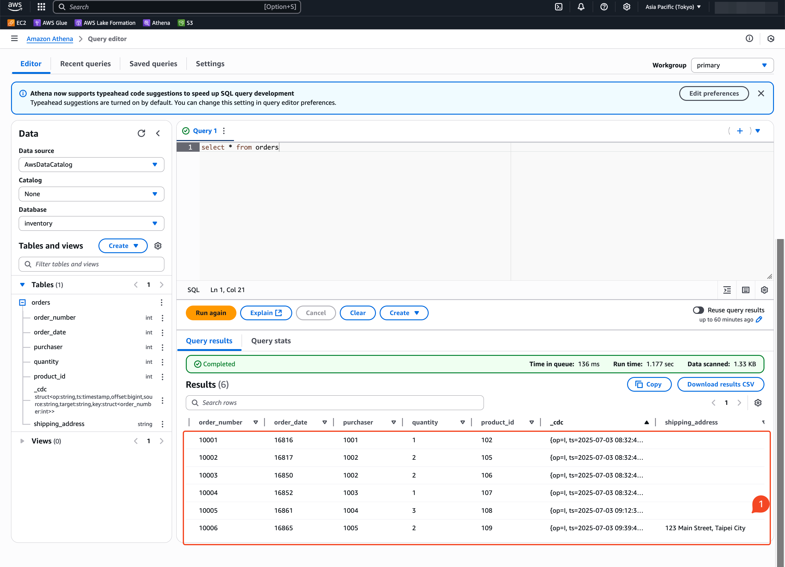

# Kafka Cluster Deployment


/// caption
Architecture Overview
///


## Build the Iceberg Connector ZIP Archive

Because the Iceberg Kafka Connect connector is not provided by Iceberg, you need to build the connector ZIP archive first. You can do this by cloning the Iceberg repository and checking out the desired version, then running the build command.

```bash
git clone https://github.com/apache/iceberg.git
git checkout apache-iceberg-1.9.1

./gradlew -x test -x integrationTest clean build
```

??? info "Result"

    ```
    Welcome to Gradle 8.13!

    Here are the highlights of this release:
    - Daemon JVM auto-provisioning
    - Enhancements for Scala plugin and JUnit testing
    - Improvements for build authors and plugin developers

    For more details see https://docs.gradle.org/8.13/release-notes.html

    Starting a Gradle Daemon (subsequent builds will be faster)
    Configuration on demand is an incubating feature.

    > Task :iceberg-aws:validateS3SignerSpec
    Validating spec /Users/kcl/projects/iceberg/aws/src/main/resources/s3-signer-open-api.yaml

    > Task :iceberg-open-api:validateRESTCatalogSpec
    Validating spec /Users/kcl/projects/iceberg/open-api/rest-catalog-open-api.yaml
    Spec is valid.

    > Task :iceberg-aws:validateS3SignerSpec
    Spec is valid.

    > Task :iceberg-spark:iceberg-spark-3.5_2.12:scalastyleMainCheck
    Processed 7 file(s)
    Found 0 errors
    Found 0 warnings
    Finished in 4727 ms

    > Task :iceberg-bundled-guava:shadowJar
    MANIFEST.MF will be copied to 'META-INF/MANIFEST.MF', overwriting MANIFEST.MF, which has already been copied there.
    file '/Users/kcl/projects/iceberg/bundled-guava/build/classes/java/main/org/apache/iceberg/GuavaClasses.class' will be copied to 'org/apache/iceberg/GuavaClasses.class', overwriting file '/Users/kcl/projects/iceberg/bundled-guava/build/classes/java/main/org/apache/iceberg/GuavaClasses.class', which has already been copied there.
    file '/Users/kcl/.gradle/caches/modules-2/files-2.1/com.google.guava/guava/33.4.7-jre/c1f6ad95476208ef852f92919e7a9e22abd83a98/guava-33.4.7-jre.jar' will be copied to 'guava-33.4.7-jre.jar', overwriting file '/Users/kcl/.gradle/caches/modules-2/files-2.1/com.google.guava/guava/33.4.7-jre/c1f6ad95476208ef852f92919e7a9e22abd83a98/guava-33.4.7-jre.jar', which has already been copied there.
    file '/Users/kcl/.gradle/caches/modules-2/files-2.1/com.google.guava/failureaccess/1.0.3/aeaffd00d57023a2c947393ed251f0354f0985fc/failureaccess-1.0.3.jar' will be copied to 'failureaccess-1.0.3.jar', overwriting file '/Users/kcl/.gradle/caches/modules-2/files-2.1/com.google.guava/failureaccess/1.0.3/aeaffd00d57023a2c947393ed251f0354f0985fc/failureaccess-1.0.3.jar', which has already been copied there.
    file '/Users/kcl/.gradle/caches/modules-2/files-2.1/com.google.guava/listenablefuture/9999.0-empty-to-avoid-conflict-with-guava/b421526c5f297295adef1c886e5246c39d4ac629/listenablefuture-9999.0-empty-to-avoid-conflict-with-guava.jar' will be copied to 'listenablefuture-9999.0-empty-to-avoid-conflict-with-guava.jar', overwriting file '/Users/kcl/.gradle/caches/modules-2/files-2.1/com.google.guava/listenablefuture/9999.0-empty-to-avoid-conflict-with-guava/b421526c5f297295adef1c886e5246c39d4ac629/listenablefuture-9999.0-empty-to-avoid-conflict-with-guava.jar', which has already been copied there.
    file '/Users/kcl/.gradle/caches/modules-2/files-2.1/org.jspecify/jspecify/1.0.0/7425a601c1c7ec76645a78d22b8c6a627edee507/jspecify-1.0.0.jar' will be copied to 'jspecify-1.0.0.jar', overwriting file '/Users/kcl/.gradle/caches/modules-2/files-2.1/org.jspecify/jspecify/1.0.0/7425a601c1c7ec76645a78d22b8c6a627edee507/jspecify-1.0.0.jar', which has already been copied there.
    file '/Users/kcl/projects/iceberg/bundled-guava/LICENSE' will be copied to 'LICENSE', overwriting file '/Users/kcl/projects/iceberg/bundled-guava/LICENSE', which has already been copied there.
    file '/Users/kcl/projects/iceberg/bundled-guava/NOTICE' will be copied to 'NOTICE', overwriting file '/Users/kcl/projects/iceberg/bundled-guava/NOTICE', which has already been copied there.

    > Task :iceberg-common:compileJava
    /Users/kcl/projects/iceberg/common/src/main/java/org/apache/iceberg/common/DynConstructors.java:270: Note: [SafeLoggingPropagation] Safe logging annotations should be propagated to encapsulating elements to allow static analysis tooling to work with as much information as possible. This check can be auto-fixed using `./gradlew classes testClasses -PerrorProneApply=SafeLoggingPropagation`
    private static String formatProblems(Map<String, Throwable> problems) {
                            ^
        (see https://github.com/palantir/gradle-baseline#baseline-error-prone-checks)
    Did you mean '@Unsafe private static String formatProblems(Map<String, Throwable> problems) {'?
    Note: Some input files use or override a deprecated API.
    Note: Recompile with -Xlint:deprecation for details.

    > Task :iceberg-api:compileJava
    /Users/kcl/projects/iceberg/api/src/main/java/org/apache/iceberg/transforms/Timestamps.java:47: warning: [ImmutableEnumChecker] enums should be immutable: 'Timestamps' has field 'apply' of type 'org.apache.iceberg.util.SerializableFunction<java.lang.Long,java.lang.Integer>', the declaration of type 'org.apache.iceberg.util.SerializableFunction<java.lang.Long,java.lang.Integer>' is not annotated with @com.google.errorprone.annotations.Immutable
    private final SerializableFunction<Long, Integer> apply;
                                                        ^
        (see https://errorprone.info/bugpattern/ImmutableEnumChecker)

    > Task :iceberg-spark:iceberg-spark-extensions-3.5_2.12:scalastyleMainCheck
    Processed 48 file(s)
    Found 0 errors
    Found 0 warnings
    Finished in 8938 ms

    > Task :iceberg-api:compileJava
    Note: Some input files use or override a deprecated API.
    Note: Recompile with -Xlint:deprecation for details.
    Note: Some input files use unchecked or unsafe operations.
    Note: Recompile with -Xlint:unchecked for details.
    1 warning

    > Task :iceberg-api:compileTestJava
    Note: Some input files use or override a deprecated API.
    Note: Recompile with -Xlint:deprecation for details.
    Note: Some input files use unchecked or unsafe operations.
    Note: Recompile with -Xlint:unchecked for details.

    > Task :iceberg-api:testJar
    file '/Users/kcl/projects/iceberg/build/iceberg-build.properties' will be copied to 'iceberg-build.properties', overwriting file '/Users/kcl/projects/iceberg/api/build/resources/test/iceberg-build.properties', which has already been copied there.

    > Task :iceberg-core:compileJava
    Note: Some input files use or override a deprecated API.
    Note: Recompile with -Xlint:deprecation for details.
    Note: Some input files use unchecked or unsafe operations.
    Note: Recompile with -Xlint:unchecked for details.

    > Task :iceberg-azure:compileJava
    /Users/kcl/projects/iceberg/azure/src/main/java/org/apache/iceberg/azure/adlsv2/ADLSFileIO.java:136: warning: [UnnecessaryParentheses] These grouping parentheses are unnecessary; it is unlikely the code will be misinterpreted without them
            .ifPresent((provider -> this.vendedAdlsCredentialProvider = provider));
                    ^
        (see https://errorprone.info/bugpattern/UnnecessaryParentheses)
    Did you mean '.ifPresent( provider -> this.vendedAdlsCredentialProvider = provider);'?
    Note: Some input files use or override a deprecated API.
    Note: Recompile with -Xlint:deprecation for details.
    1 warning

    > Task :iceberg-aliyun:compileJava
    Note: Some input files use or override a deprecated API.
    Note: Recompile with -Xlint:deprecation for details.

    > Task :iceberg-parquet:compileJava
    Note: Some input files use or override a deprecated API.
    Note: Recompile with -Xlint:deprecation for details.
    Note: Some input files use unchecked or unsafe operations.
    Note: Recompile with -Xlint:unchecked for details.

    > Task :iceberg-aws:compileJava
    Note: Some input files use or override a deprecated API.
    Note: Recompile with -Xlint:deprecation for details.
    Note: Some input files use unchecked or unsafe operations.
    Note: Recompile with -Xlint:unchecked for details.

    > Task :iceberg-data:compileJava
    Note: Some input files use or override a deprecated API.
    Note: Recompile with -Xlint:deprecation for details.

    > Task :iceberg-arrow:compileJava
    Note: /Users/kcl/projects/iceberg/arrow/src/main/java/org/apache/iceberg/arrow/ArrowSchemaUtil.java uses or overrides a deprecated API.
    Note: Recompile with -Xlint:deprecation for details.

    > Task :iceberg-core:compileTestJava
    Note: Some input files use or override a deprecated API.
    Note: Recompile with -Xlint:deprecation for details.
    Note: Some input files use unchecked or unsafe operations.
    Note: Recompile with -Xlint:unchecked for details.

    > Task :iceberg-gcp:compileJava
    Note: Some input files use or override a deprecated API.
    Note: Recompile with -Xlint:deprecation for details.

    > Task :iceberg-aws:compileTestJava
    Note: Some input files use or override a deprecated API.
    Note: Recompile with -Xlint:deprecation for details.

    > Task :iceberg-aws:compileIntegrationJava
    Note: Some input files use or override a deprecated API.
    Note: Recompile with -Xlint:deprecation for details.
    Note: Some input files use unchecked or unsafe operations.
    Note: Recompile with -Xlint:unchecked for details.

    > Task :iceberg-arrow:compileTestJava
    Note: /Users/kcl/projects/iceberg/arrow/src/test/java/org/apache/iceberg/arrow/vectorized/ArrowReaderTest.java uses or overrides a deprecated API.
    Note: Recompile with -Xlint:deprecation for details.

    > Task :iceberg-data:compileTestJava
    Note: Some input files use or override a deprecated API.
    Note: Recompile with -Xlint:deprecation for details.
    Note: Some input files use unchecked or unsafe operations.
    Note: Recompile with -Xlint:unchecked for details.

    > Task :iceberg-hive-metastore:compileTestJava
    Note: /Users/kcl/projects/iceberg/hive-metastore/src/test/java/org/apache/iceberg/hive/TestHiveCatalog.java uses or overrides a deprecated API.
    Note: Recompile with -Xlint:deprecation for details.
    Note: /Users/kcl/projects/iceberg/hive-metastore/src/test/java/org/apache/iceberg/hive/TestHiveCatalog.java uses unchecked or unsafe operations.
    Note: Recompile with -Xlint:unchecked for details.

    > Task :iceberg-mr:compileJava
    Note: /Users/kcl/projects/iceberg/mr/src/main/java/org/apache/iceberg/mr/mapred/MapredIcebergInputFormat.java uses unchecked or unsafe operations.
    Note: Recompile with -Xlint:unchecked for details.

    > Task :iceberg-nessie:compileJava
    Note: /Users/kcl/projects/iceberg/nessie/src/main/java/org/apache/iceberg/nessie/NessieIcebergClient.java uses or overrides a deprecated API.
    Note: Recompile with -Xlint:deprecation for details.

    > Task :iceberg-parquet:javadoc
    /Users/kcl/projects/iceberg/parquet/src/main/java/org/apache/iceberg/data/parquet/GenericParquetWriter.java:64: warning: reference not accessible: org.apache.iceberg.data.parquet.BaseParquetWriter
    * @deprecated will be removed in 1.10.0; use {@link #createWriter(Types.StructType, MessageType)}
                                                    ^
    /Users/kcl/projects/iceberg/parquet/src/main/java/org/apache/iceberg/data/parquet/InternalWriter.java:67: warning: reference not accessible: org.apache.iceberg.data.parquet.BaseParquetWriter
    * @deprecated will be removed in 1.10.0; use {@link #createWriter(Types.StructType, MessageType)}
                                                    ^
    /Users/kcl/projects/iceberg/parquet/src/main/java/org/apache/iceberg/data/parquet/GenericParquetWriter.java:64: warning: reference not accessible: org.apache.iceberg.data.parquet.BaseParquetWriter
    * @deprecated will be removed in 1.10.0; use {@link #createWriter(Types.StructType, MessageType)}
                                                    ^
    /Users/kcl/projects/iceberg/parquet/src/main/java/org/apache/iceberg/data/parquet/InternalWriter.java:67: warning: reference not accessible: org.apache.iceberg.data.parquet.BaseParquetWriter
    * @deprecated will be removed in 1.10.0; use {@link #createWriter(Types.StructType, MessageType)}
                                                    ^
    4 warnings

    > Task :iceberg-parquet:compileTestJava
    Note: Some input files use or override a deprecated API.
    Note: Recompile with -Xlint:deprecation for details.

    > Task :iceberg-spark:iceberg-spark-3.5_2.12:compileScala
    [Warn] : javac: [options] system modules path not set in conjunction with -source 11
    Could not determine source for class org.apache.iceberg.spark.ImmutableParquetBatchReadConf
    Could not determine source for class org.apache.iceberg.spark.ImmutableOrcBatchReadConf$Builder
    Could not determine source for class org.apache.iceberg.spark.ImmutableOrcBatchReadConf
    Could not determine source for class org.apache.iceberg.spark.ImmutableParquetBatchReadConf$Builder

    > Task :iceberg-kafka-connect:iceberg-kafka-connect:compileJava
    Note: /Users/kcl/projects/iceberg/kafka-connect/kafka-connect/src/main/java/org/apache/iceberg/connect/channel/CommitterImpl.java uses or overrides a deprecated API.
    Note: Recompile with -Xlint:deprecation for details.

    > Task :iceberg-flink:iceberg-flink-1.20:compileJava
    Note: Some input files use or override a deprecated API.
    Note: Recompile with -Xlint:deprecation for details.
    Note: Some input files use unchecked or unsafe operations.
    Note: Recompile with -Xlint:unchecked for details.

    > Task :iceberg-spark:iceberg-spark-3.5_2.12:compileTestJava
    Note: Some input files use or override a deprecated API.
    Note: Recompile with -Xlint:deprecation for details.
    Note: Some input files use unchecked or unsafe operations.
    Note: Recompile with -Xlint:unchecked for details.

    > Task :iceberg-spark:iceberg-spark-3.5_2.12:compileJmhJava
    Note: Some input files use or override a deprecated API.
    Note: Recompile with -Xlint:deprecation for details.

    > Task :iceberg-spark:iceberg-spark-extensions-3.5_2.12:compileTestJava
    Note: /Users/kcl/projects/iceberg/spark/v3.5/spark-extensions/src/test/java/org/apache/iceberg/spark/extensions/TestRewritePositionDeleteFiles.java uses or overrides a deprecated API.
    Note: Recompile with -Xlint:deprecation for details.
    Note: Some input files use unchecked or unsafe operations.
    Note: Recompile with -Xlint:unchecked for details.

    > Task :iceberg-flink:iceberg-flink-1.20:compileTestJava
    Note: Some input files use or override a deprecated API.
    Note: Recompile with -Xlint:deprecation for details.
    Note: Some input files use unchecked or unsafe operations.
    Note: Recompile with -Xlint:unchecked for details.

    [Incubating] Problems report is available at: file:///Users/kcl/projects/iceberg/build/reports/problems/problems-report.html

    Deprecated Gradle features were used in this build, making it incompatible with Gradle 9.0.

    You can use '--warning-mode all' to show the individual deprecation warnings and determine if they come from your own scripts or plugins.

    For more on this, please refer to https://docs.gradle.org/8.13/userguide/command_line_interface.html#sec:command_line_warnings in the Gradle documentation

    BUILD SUCCESSFUL in 27m 45s
    454 actionable tasks: 443 executed, 5 from cache, 6 up-to-date
    ```

The ZIP archive will be found under `./kafka-connect/kafka-connect-runtime/build/distributions`. There is one distribution that bundles the Hive Metastore client and related dependencies, and one that does not.

Upload the ZIP archive to a publicly accessible S3 bucket so that the Iceberg Kafka Connect connector can be downloaded during the Kafka Connect cluster creation and image build process. Make note of the ZIP archive URL, as it will be required in subsequent steps.


## Create a Secret for Connecting to AWS

```yaml title="iceberg-secret.yaml" linenums="1" hl_lines="4 5"
--8<-- "./kafka-cluster/iceberg-secret.yaml"
```

```bash
kubectl apply -f iceberg-secret.yaml -n kafka-cdc
```

## Create an Iceberg Kafka Connect Cluster

```yaml title="iceberg-connect-cluster.yaml" linenums="1" hl_lines="4 5"
--8<-- "./kafka-cluster/iceberg-connect-cluster.yaml"
```

```bash
kubectl apply -f iceberg-connect-cluster.yaml -n kafka-cdc
```

```bash
kubectl get all -n kafka-cdc

NAME                                                 READY   STATUS    RESTARTS   AGE
pod/debezium-connect-cluster-connect-0               1/1     Running   0          8m15s
{==pod/iceberg-connect-cluster-connect-0==}                1/1     Running   0          73s
pod/kafka-cluster-dual-role-0                        1/1     Running   0          14m
pod/kafka-cluster-dual-role-1                        1/1     Running   0          14m
pod/kafka-cluster-dual-role-2                        1/1     Running   0          14m
pod/kafka-cluster-entity-operator-598bb8df8b-q2d4x   2/2     Running   0          13m
pod/mysql-6b84fd947d-kpdk4                           1/1     Running   0          12m

NAME                                           TYPE        CLUSTER-IP       EXTERNAL-IP   PORT(S)                                        AGE
service/debezium-connect-cluster-connect       ClusterIP   None             <none>        8083/TCP                                       8m15s
service/debezium-connect-cluster-connect-api   ClusterIP   10.103.185.205   <none>        8083/TCP                                       8m15s
{==service/iceberg-connect-cluster-connect==}        ClusterIP   None             <none>        8083/TCP                                       73s
{==service/iceberg-connect-cluster-connect-api==}    ClusterIP   10.102.45.63     <none>        8083/TCP                                       73s
service/kafka-cluster-kafka-bootstrap          ClusterIP   10.105.98.134    <none>        9091/TCP,9092/TCP,9093/TCP                     14m
service/kafka-cluster-kafka-brokers            ClusterIP   None             <none>        9090/TCP,9091/TCP,8443/TCP,9092/TCP,9093/TCP   14m
service/mysql                                  ClusterIP   None             <none>        3306/TCP                                       12m

NAME                                            READY   UP-TO-DATE   AVAILABLE   AGE
deployment.apps/kafka-cluster-entity-operator   1/1     1            1           13m
deployment.apps/mysql                           1/1     1            1           12m

NAME                                                       DESIRED   CURRENT   READY   AGE
replicaset.apps/kafka-cluster-entity-operator-598bb8df8b   1         1         1       13m
replicaset.apps/mysql-6b84fd947d                           1         1         1       12m
```

## Create an Iceberg Sink Connector

```yaml title="iceberg-connector.yaml" linenums="1" hl_lines="4 5"
--8<-- "./kafka-cluster/iceberg-connector.yaml"
```

```bash
kubectl apply -f iceberg-connector.yaml -n kafka-cdc
```

```bash
kubectl get kafkaconnector -n kafka-cdc

NAME                 CLUSTER                    CONNECTOR CLASS                                   MAX TASKS   READY
debezium-connector   debezium-connect-cluster   io.debezium.connector.mysql.MySqlConnector        1           True
iceberg-connector    iceberg-connect-cluster    org.apache.iceberg.connect.IcebergSinkConnector   1           True
```

## Verify the Data Pipeline


```bash
kubectl exec -n kafka-cdc -it mysql-6b84fd947d-9g9lt -- mysql -uroot -pdebezium
```

```bash
sql> use inventory;
sql> INSERT INTO orders (order_date, purchaser, quantity, product_id)
VALUES ('2016-03-01', 1004, 3, 108);
```


### Schema Evolution



```
mysql> ALTER TABLE orders ADD COLUMN shipping_address TEXT DEFAULT NULL;
Query OK, 0 rows affected (0.30 sec)
Records: 0  Duplicates: 0  Warnings: 0
```

```
mysql> describe orders;
+------------------+------+------+-----+---------+----------------+
| Field            | Type | Null | Key | Default | Extra          |
+------------------+------+------+-----+---------+----------------+
| order_number     | int  | NO   | PRI | NULL    | auto_increment |
| order_date       | date | NO   |     | NULL    |                |
| purchaser        | int  | NO   | MUL | NULL    |                |
| quantity         | int  | NO   |     | NULL    |                |
| product_id       | int  | NO   | MUL | NULL    |                |
| shipping_address | text | YES  |     | NULL    |                |
+------------------+------+------+-----+---------+----------------+
6 rows in set (0.05 sec)
```

```
mysql> select * from orders;
+--------------+------------+-----------+----------+------------+------------------+
| order_number | order_date | purchaser | quantity | product_id | shipping_address |
+--------------+------------+-----------+----------+------------+------------------+
|        10001 | 2016-01-16 |      1001 |        1 |        102 | NULL             |
|        10002 | 2016-01-17 |      1002 |        2 |        105 | NULL             |
|        10003 | 2016-02-19 |      1002 |        2 |        106 | NULL             |
|        10004 | 2016-02-21 |      1003 |        1 |        107 | NULL             |
|        10005 | 2016-03-01 |      1004 |        3 |        108 | NULL             |
+--------------+------------+-----------+----------+------------+------------------+
5 rows in set (0.00 sec)
```


```
INSERT INTO orders (order_date, purchaser, quantity, product_id, shipping_address)
VALUES ('2016-03-05', 1005, 2, 109, '123 Main Street, Taipei City');
Query OK, 1 row affected (0.04 sec)
```

```
mysql> select * from orders;
+--------------+------------+-----------+----------+------------+------------------------------+
| order_number | order_date | purchaser | quantity | product_id | shipping_address             |
+--------------+------------+-----------+----------+------------+------------------------------+
|        10001 | 2016-01-16 |      1001 |        1 |        102 | NULL                         |
|        10002 | 2016-01-17 |      1002 |        2 |        105 | NULL                         |
|        10003 | 2016-02-19 |      1002 |        2 |        106 | NULL                         |
|        10004 | 2016-02-21 |      1003 |        1 |        107 | NULL                         |
|        10005 | 2016-03-01 |      1004 |        3 |        108 | NULL                         |
|        10006 | 2016-03-05 |      1005 |        2 |        109 | 123 Main Street, Taipei City |
+--------------+------------+-----------+----------+------------+------------------------------+
6 rows in set (0.02 sec)
```

## References

- [Deploying Debezium on Kubernetes | Debezium Documentation](https://debezium.io/documentation//reference/stable/operations/kubernetes.html)
- [Deploying and Managing | Strimzi Documentation](https://strimzi.io/docs/operators/latest/deploying)
- [Using the Iceberg framework in AWS Glue | AWS](https://docs.aws.amazon.com/glue/latest/dg/aws-glue-programming-etl-format-iceberg.html)
- [Iceberg Kafka Connector | Iceberg](https://iceberg.apache.org/docs/latest/kafka-connect/)