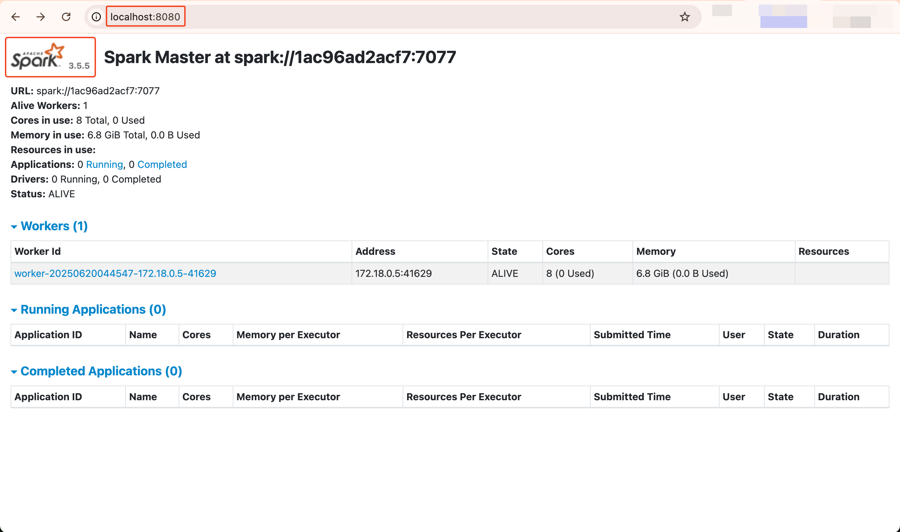
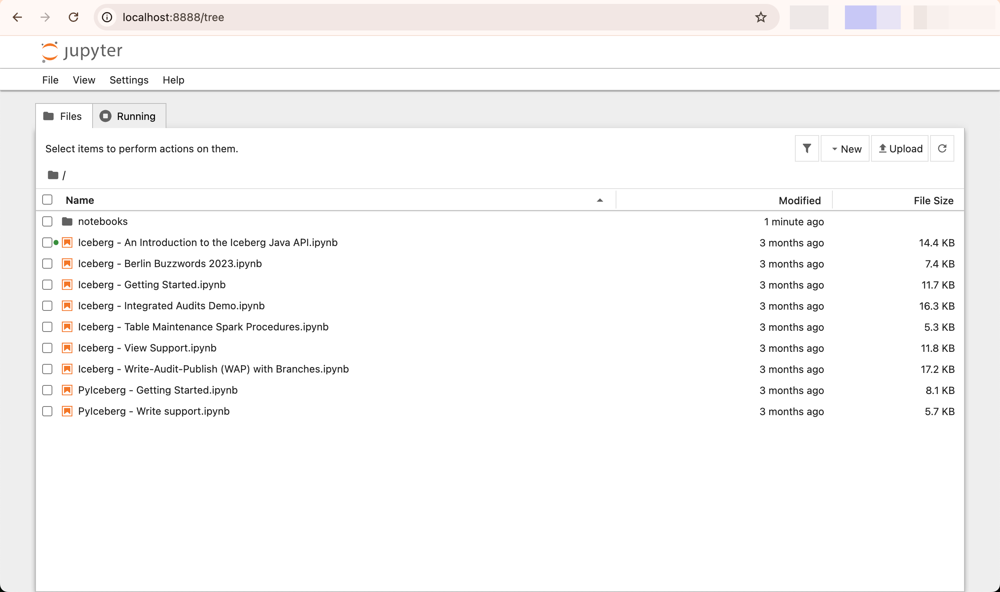

# Spark Quickstart

## Docker-Compose

```dockerfile
--8<-- "iceberg/spark-quickstart/docker-compose.yml"
```

This Docker Compose configuration sets up a complete Apache Iceberg development environment with the following components:


### Spark Service (`spark-iceberg`)

The main Spark service that provides the computational engine for working with Iceberg tables:

- **Image**: `tabulario/spark-iceberg` - A pre-configured Spark image with Iceberg support
- **Ports**: 
  - `8888`: Jupyter notebook interface
  - `8080`: Spark UI
  - `10000-10001`: Spark Thrift server ports
- **Volumes**: Mounts local directories for warehouse data and notebooks
- **Dependencies**: Requires both the REST catalog and MinIO services to be running


### REST Catalog Service (`rest`)

Apache Iceberg's REST catalog service for metadata management:

- **Image**: `apache/iceberg-rest-fixture` - Official Iceberg REST catalog
- **Port**: `8181` - REST API endpoint
- **Configuration**: 
  - Connects to MinIO S3-compatible storage
  - Uses `s3://warehouse/` as the warehouse location
  - Configured with S3FileIO for object storage operations


### MinIO Service (`minio`)

S3-compatible object storage for storing Iceberg table data:

- **Image**: `minio/minio` - Open-source S3-compatible storage
- **Ports**:
  - `9000`: S3 API endpoint
  - `9001`: MinIO web console
- **Credentials**: admin/password (for development only)
- **Storage**: Serves data from `/data` directory inside container


### MinIO Client Service (`mc`)

Initialization service that sets up the MinIO storage:

- **Purpose**: Creates and configures the warehouse bucket
- **Actions**:
  - Waits for MinIO to be ready
  - Creates the `warehouse` bucket
  - Sets public access policy for development
  - Runs indefinitely to keep the service active


### Networking

All services communicate through the `iceberg_net` custom network, enabling:

- Service discovery by container name
- Isolated network environment
- MinIO alias configuration for S3 compatibility

---

```bash
docker-compose up
```

Spark UI will be available at http://localhost:8080:



Then go to the notebook server available at http://localhost:8888:




## Creating a table


## Writing Data to a Table


## Reading Data from a Table


## Adding A Catalog


## Next Steps

