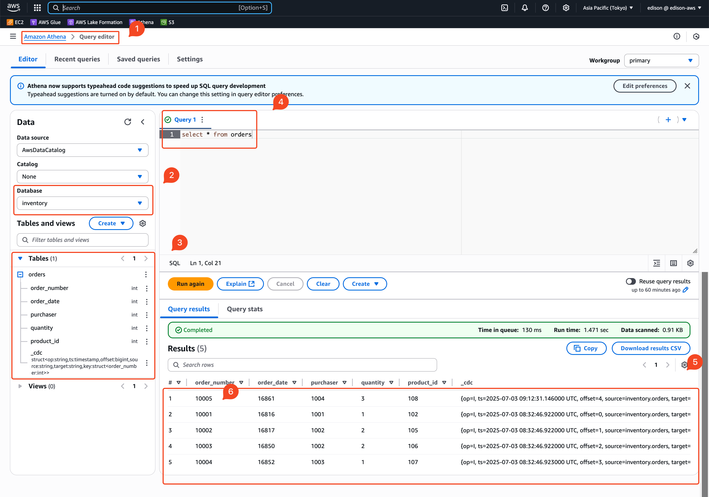

# Deployment


You can deploy Strimzi on Kubernetes 1.25 and later using one of the following methods:

- Deployment files (YAML files)
- OperatorHub.io
- Helm chart

The basic deployment path includes the following steps:

- Deploy the Strimzi Cluster Operator
- Deploy a Kafka Cluster
- Deploy a MySQL Database
- Deploy a Debezium Source Connector
    - Create a Secret for Connecting to the Database
    - Create a Debezium Kafka Connect Cluster
    - Create a Debezium Source Connector
    - Verify the Data Pipeline
- Deploy an Iceberg Sink Connector
    - Create a Secret for Connecting to AWS
    - Create an Iceberg Kafka Connect Cluster
    - Create an Iceberg Sink Connector
    - Verify the Data Pipeline

## Deploy the Strimzi Cluster Operator

Before we dive into deploying Kafka, let's talk about what Strimzi is and why we need it. **Strimzi** is a Kubernetes operator that makes running Apache Kafka on Kubernetes much easier. Think of it as your Kafka cluster manager - it handles all the complex setup, configuration, and maintenance tasks that would otherwise require manual intervention.

Instead of manually creating Kafka pods, services, and configurations, Strimzi lets you define what you want in simple YAML files, and it takes care of the rest.

First, we need to create two separate Kubernetes namespaces, one for the Strimzi operator and another for our Kafka cluster:

```bash
kubectl create namespace strimzi
kubectl create namespace kafka-cdc
```

Why separate namespaces? It's a best practice to keep the operator (the manager) separate from the workloads it manages (the Kafka cluster). This makes it easier to manage permissions and troubleshoot issues.


Before installing Strimzi, let's take a look at what configuration options are available. Helm charts come with default values, but it's always good to see what we can customize:

```bash
helm show values oci://quay.io/strimzi-helm/strimzi-kafka-operator > values-default.yaml
```

The most important setting we'll change is `watchNamespaces` - this tells Strimzi which namespaces it should monitor for Kafka-related resources.

Here's our customized configuration:

??? info "values.yaml"

    ```yaml linenums="1" hl_lines="8 9"
    --8<-- "./retail-lakehouse/kafka/values.yaml"
    ```

The highlighted lines tell Strimzi to specifically watch the `kafka-cdc` namespace where we'll deploy our Kafka cluster.

Now for the exciting part - let's install Strimzi using Helm:

```bash
helm install strimzi-cluster-operator oci://quay.io/strimzi-helm/strimzi-kafka-operator -f values.yaml -n strimzi
```

If everything goes well, you'll see output like this:

```
Pulled: quay.io/strimzi-helm/strimzi-kafka-operator:0.46.1
Digest: sha256:e87ea2a03985f5dd50fee1f8706f737fa1151b86dce5021b6c0798ac8b17e27f
NAME: {==strimzi-cluster-operator==}
LAST DEPLOYED: Sun Jun 29 17:25:49 2025
NAMESPACE: strimzi
STATUS: deployed
REVISION: 1
TEST SUITE: None
NOTES:
Thank you for installing {==strimzi-kafka-operator-0.46.1==}

To create a Kafka cluster refer to the following documentation.

https://strimzi.io/docs/operators/latest/deploying.html#deploying-cluster-operator-helm-chart-str
```

Great! The `STATUS: deployed` tells us everything went smoothly.

Let's make sure our Strimzi operator is actually running. First, let's check if Helm recognizes our installation:

```bash
helm ls -n strimzi
```

You should see something like this:

```
NAME                    	NAMESPACE	REVISION	UPDATED                             	STATUS  	HART                        	APP VERSION
strimzi-cluster-operator	strimzi  	1       	2025-06-29 17:25:49.773026 +0800 CST	deployed	trimzi-kafka-operator-0.46.1	0.46.1     
```

Now let's check what Kubernetes resources were actually created:

```bash
kubectl get all -n strimzi
```

Here's what you should see:

```
NAME                                           READY   STATUS    RESTARTS   AGE
pod/strimzi-cluster-operator-74f577b78-s9n25   1/1     Running   0          108s

NAME                                           READY   UP-TO-DATE   AVAILABLE   AGE
deployment.apps/strimzi-cluster-operator       1/1     1            1           108s

NAME                                                 DESIRED   CURRENT   READY   AGE
replicaset.apps/strimzi-cluster-operator-74f577b78   1         1         1       108s
```

Perfect! At this point, the Strimzi operator is running and watching for Kafka-related resources in the `kafka-cdc` namespace. It's like having a dedicated Kafka administrator ready to spring into action whenever we create Kafka clusters or related components.

## Deploy a Kafka Cluster

Now that we have Strimzi operator running, let's deploy our actual Kafka cluster! If you're coming from a traditional Kafka background, you might be expecting to see ZooKeeper configurations, but we're going to use Kafka's newer KRaft mode instead. Think of KRaft as Kafka's way of saying "I don't need ZooKeeper anymore - I can manage my own metadata."

The configuration file we'll use defines not just a Kafka cluster, but also something called a KafkaNodePool. This is Strimzi's way of letting you organize your Kafka nodes into different groups with different roles and storage configurations.

```yaml title="kafka-cluster.yaml"
--8<-- "./retail-lakehouse/kafka/kafka-cluster.yaml"
```

Let's break down what this configuration is telling Kubernetes to create for us.

**The Kafka 4.0 Context**: You'll notice we're using Kafka 4.0, which defaults to KRaft mode. The `metadataVersion: 4.0-IV3` setting is important - the "IV" stands for "Incompatible Version," which means this version has significant metadata structure changes that aren't backward compatible. We need to explicitly specify this to confirm we understand we're using the latest format.

### Understanding KRaft Mode

If you've worked with Kafka before, you might remember the pain of managing ZooKeeper alongside your Kafka clusters. KRaft mode eliminates that complexity entirely. Here's what makes it special:

**What KRaft Replaces**: Instead of relying on an external ZooKeeper ensemble to store Kafka's metadata (like topic configurations, partition assignments, and cluster membership), Kafka brokers now handle this responsibility themselves using a consensus algorithm similar to Raft.

**Why This Matters**:

- **Simplified Operations**: One less system to deploy, monitor, and troubleshoot
- **Better Performance**: No more network hops to ZooKeeper for metadata operations
- **Improved Reliability**: Fewer moving parts means fewer potential failure points

To enable KRaft mode in Strimzi, we add two key annotations to our Kafka resource:

- `strimzi.io/node-pools: enabled`: Tells Strimzi we want to use the newer node pool architecture
- `strimzi.io/kraft: enabled`: Enables KRaft mode instead of ZooKeeper

### Node Pools: Organizing Your Kafka Nodes

The `KafkaNodePool` concept lets you organize your Kafka nodes into logical groups. In our case, we're creating a "dual-role" pool where each node acts as both a **controller** (managing metadata) and a **broker** (handling client requests).

**Our Dual-Role Setup**: We're creating 3 nodes that each serve both functions. This is perfect for development and smaller production deployments because:

- **Resource Efficient**: Fewer total machines needed
- **Simpler Architecture**: No need to separate controller and broker concerns
- **Still Highly Available**: With 3 nodes, we can tolerate losing one node

**Storage Configuration**: Each node gets a 100GB persistent volume that stores both regular Kafka logs and KRaft metadata. The `kraftMetadata: shared` setting means both types of data live on the same disk, which is fine for most use cases.

### Listeners: How Clients Connect

Our configuration sets up two ways for applications to connect to Kafka:

**Plain Listener (port 9092)**: This is your standard, unencrypted connection. Perfect for:

- Development environments
- Internal applications where network security is handled at other layers
- High-throughput scenarios where TLS overhead isn't desired

**TLS Listener (port 9093)**: This provides encrypted connections for:

- Cross-namespace communication
- Production environments with security requirements
- Any scenario where data in transit needs protection

### Configuration Deep Dive

The configuration section ensures our cluster is production-ready with proper replication and consistency guarantees:

**Replication Settings**: We're telling Kafka to keep 3 copies of everything - your regular topics, consumer offset tracking, and transaction state. This means we can lose one broker and still have all our data.

**Consistency Settings**: The `min.insync.replicas: 2` setting is particularly important. It means that when a producer sends a message, Kafka won't acknowledge it as "successfully written" until at least 2 brokers have the data. This prevents data loss even if a broker fails right after acknowledging a write.

### Watching Your Cluster Come Online

Now let's deploy this configuration and see it come to life!

```bash
kubectl create -f kafka-cluster.yaml -n kafka-cdc
```

This command tells Kubernetes to create both the Kafka cluster and the node pool in our `kafka-cdc` namespace. You should see output confirming both resources were created:

```
kafka.kafka.strimzi.io/kafka-cluster created
kafkanodepool.kafka.strimzi.io/dual-role created
```


Kafka clusters take a bit of time to start up - they need to elect controllers, establish consensus, and create internal topics. Let's check on the progress:

```bash
kubectl get all -n kafka-cdc
```

Initially, you might see pods in `Pending` or `ContainerCreating` status. After a minute or two, you should see something like this:

```
NAME                                                    READY   STATUS    RESTARTS   AGE
pod/kafka-cluster-dual-role-0                           1/1     Running   0          60s
pod/kafka-cluster-dual-role-1                           1/1     Running   0          60s
pod/kafka-cluster-dual-role-2                           1/1     Running   0          60s
pod/kafka-cluster-entity-operator-5b998f6cbf-c8hdf      2/2     Running   0          24s

NAME                                       TYPE        CLUSTER-IP      EXTERNAL-IP   PORT(S)                                        AGE
service/kafka-cluster-kafka-bootstrap      ClusterIP   10.105.50.103   <none>        9091/TCP,9092/TCP,9093/TCP                     61s
service/kafka-cluster-kafka-brokers        ClusterIP   None            <none>        9090/TCP,9091/TCP,8443/TCP,9092/TCP,9093/TCP   61s

NAME                                               READY   UP-TO-DATE   AVAILABLE   AGE
deployment.apps/kafka-cluster-entity-operator      1/1     1            1           24s

NAME                                                          DESIRED   CURRENT   READY   AGE
replicaset.apps/kafka-cluster-entity-operator-5b998f6cbf      1         1         1       24s
```

**What You're Seeing**:

- **Three Kafka Pods**: These are your dual-role nodes, numbered 0, 1, and 2
- **Entity Operator**: This Strimzi component manages Kafka topics and users for you
- **Bootstrap Service**: This is how clients discover and connect to your Kafka cluster
- **Broker Service**: This provides direct access to individual brokers when needed

Congratulations! You now have a fully functional Kafka cluster running in KRaft mode. In the next section, we'll deploy a MySQL database that will serve as our data source for change data capture.

## Deploy a MySQL Database

```yaml title="db.yaml"
--8<-- "./retail-lakehouse/kafka/db.yaml"
```

```bash
kubectl apply -f db.yaml -n kafka-cdc
```

```
service/mysql created
deployment.apps/mysql created
```

```bash
kubectl get all -n kafka-cdc
```

```
NAME                                                    READY   STATUS    RESTARTS   AGE
pod/kafka-cluster-dual-role-0                           1/1     Running   0          15m
pod/kafka-cluster-dual-role-1                           1/1     Running   0          15m
pod/kafka-cluster-dual-role-2                           1/1     Running   0          15m
pod/kafka-cluster-entity-operator-5b998f6cbf-c8hdf      2/2     Running   0          15m
{==pod/mysql-6b84fd947d-9g9lt==}                              1/1     Running   0          10m

NAME                                       TYPE        CLUSTER-IP      EXTERNAL-IP   PORT(S)                                        AGE
service/kafka-cluster-kafka-bootstrap      ClusterIP   10.105.50.103   <none>        9091/TCP,9092/TCP,9093/TCP                     15m
service/kafka-cluster-kafka-brokers        ClusterIP   None            <none>        9090/TCP,9091/TCP,8443/TCP,9092/TCP,9093/TCP   15m
{==service/mysql==}                              ClusterIP   None            <none>        3306/TCP                                       10m

NAME                                               READY   UP-TO-DATE   AVAILABLE   AGE
deployment.apps/kafka-cluster-entity-operator      1/1     1            1           15m
{==deployment.apps/mysql==}                              1/1     1            1           10m

NAME                                                          DESIRED   CURRENT   READY   AGE
replicaset.apps/kafka-cluster-entity-operator-5b998f6cbf      1         1         1       15m
{==replicaset.apps/mysql-6b84fd947d==}                              1         1         1       10m
```


## Deploy a Debezium Source Connector

### Create Secrets for the Database

```yaml title="debezium-secret.yaml" linenums="1" hl_lines="4"
--8<-- "./retail-lakehouse/kafka/debezium-secret.yaml"
```

```yaml title="debezium-role.yaml" linenums="1" hl_lines="4 9"
--8<-- "./retail-lakehouse/kafka/debezium-role.yaml"
```

```yaml title="debezium-role-binding.yaml" linenums="1" hl_lines="4 8 12"
--8<-- "./retail-lakehouse/kafka/debezium-role-binding.yaml"
```

```bash
kubectl apply -f debezium-secret.yaml
kubectl apply -f debezium-role.yaml
kubectl apply -f debezium-role-binding.yaml
```

```
secret/debezium-secret created
role.rbac.authorization.k8s.io/debezium-role created
rolebinding.rbac.authorization.k8s.io/debezium-role-binding created
```

### Create a Debezium Kafka Connect Cluster

To deploy a Debezium connector, you need to deploy a Kafka Connect cluster with the required connector plug-in(s), before instantiating the actual connector itself.

As the first step, a container image for Kafka Connect with the plug-in has to be created.

Strimzi also can be used for building and pushing the required container image for us. In fact, both tasks can be merged together and instructions for building the container image can be provided directly within the `KafkaConnect` object specification:

```bash
minikube addons enable registry
```

```
💡  registry is an addon maintained by minikube. For any concerns contact minikube on GitHub.
You can view the list of minikube maintainers at: https://github.com/kubernetes/minikube/blob/master/OWNERS
╭──────────────────────────────────────────────────────────────────────────────────────────────────────╮
│                                                                                                      │
│    Registry addon with docker driver uses port 49609 please use that instead of default port 5000    │
│                                                                                                      │
╰──────────────────────────────────────────────────────────────────────────────────────────────────────╯
📘  For more information see: https://minikube.sigs.k8s.io/docs/drivers/docker
    ▪ Using image docker.io/registry:2.8.3
    ▪ Using image gcr.io/k8s-minikube/kube-registry-proxy:0.0.6
🔎  Verifying registry addon...
🌟  The 'registry' addon is enabled
```

```bash
kubectl -n kube-system get svc registry -o jsonpath='{.spec.clusterIP}'

10.98.201.207
```

```yaml title="debezium-connect-cluster.yaml"
--8<-- "./retail-lakehouse/kafka/debezium-connect-cluster.yaml"
```

```bash
kubectl apply -f debezium-connect-cluster.yaml -n kafka-cdc
```

```
kafkaconnect.kafka.strimzi.io/debezium-connect-cluster created
```

Check the current resources in the `kafka-cdc` namespace:

```bash
kubectl get all -n kafka-cdc
```

```
NAME                                                    READY   STATUS    RESTARTS   AGE
pod/kafka-cluster-dual-role-0                           1/1     Running   0          66m
pod/kafka-cluster-dual-role-1                           1/1     Running   0          66m
pod/kafka-cluster-dual-role-2                           1/1     Running   0          66m
pod/kafka-cluster-entity-operator-5b998f6cbf-c8hdf      2/2     Running   0          65m
{==pod/debezium-connect-cluster-connect-build==}              1/1     Running   0          49s
pod/mysql-6b84fd947d-9g9lt                              1/1     Running   0          60m

NAME                                       TYPE        CLUSTER-IP      EXTERNAL-IP   PORT(S)                                        AGE
service/kafka-cluster-kafka-bootstrap      ClusterIP   10.105.50.103   <none>        9091/TCP,9092/TCP,9093/TCP                     66m
service/kafka-cluster-kafka-brokers        ClusterIP   None            <none>        9090/TCP,9091/TCP,8443/TCP,9092/TCP,9093/TCP   66m
service/mysql                              ClusterIP   None            <none>        3306/TCP                                       60m

NAME                                               READY   UP-TO-DATE   AVAILABLE   AGE
deployment.apps/kafka-cluster-entity-operator      1/1     1            1           65m
deployment.apps/mysql                              1/1     1            1           60m

NAME                                                          DESIRED   CURRENT   READY   AGE
replicaset.apps/kafka-cluster-entity-operator-5b998f6cbf      1         1         1       65m
replicaset.apps/mysql-6b84fd947d                              1         1         1       60m
```

過一陣子後

```
NAME                                                    READY   STATUS    RESTARTS   AGE
pod/kafka-cluster-dual-role-0                           1/1     Running   0          100m
pod/kafka-cluster-dual-role-1                           1/1     Running   0          100m
pod/kafka-cluster-dual-role-2                           1/1     Running   0          100m
pod/kafka-cluster-entity-operator-5b998f6cbf-c8hdf      2/2     Running   0          99m
{==pod/debezium-connect-cluster-connect-0==}                  1/1     Running   0          30m
pod/mysql-6b84fd947d-9g9lt                              1/1     Running   0          94m

NAME                                           TYPE        CLUSTER-IP       EXTERNAL-IP   PORT(S)                                        AGE
service/kafka-cluster-kafka-bootstrap          ClusterIP   10.105.50.103    <none>        9091/TCP,9092/TCP,9093/TCP                     100m
service/kafka-cluster-kafka-brokers            ClusterIP   None             <none>        9090/TCP,9091/TCP,8443/TCP,9092/TCP,9093/TCP   100m
{==service/debezium-connect-cluster-connect==}       ClusterIP   None             <none>        8083/TCP                                       30m
{==service/debezium-connect-cluster-connect-api==}   ClusterIP   10.100.229.177   <none>        8083/TCP                                       30m
service/mysql                                  ClusterIP   None             <none>        3306/TCP                                       94m

NAME                                               READY   UP-TO-DATE   AVAILABLE   AGE
deployment.apps/kafka-cluster-entity-operator      1/1     1            1           99m
deployment.apps/mysql                              1/1     1            1           94m

NAME                                                          DESIRED   CURRENT   READY   AGE
replicaset.apps/kafka-cluster-entity-operator-5b998f6cbf      1         1         1       99m
replicaset.apps/mysql-6b84fd947d                              1         1         1       94m
```


### Create a Debezium Source Connector

```yaml title="debezium-connector.yaml"
--8<-- "./retail-lakehouse/kafka/debezium-connector.yaml"
```

```bash
kubectl apply -f debezium-connector.yaml -n kafka-cdc
```

```
kafkaconnector.kafka.strimzi.io/debezium-connector created
```

```bash
kubectl get kafkaconnector debezium-connector -n kafka-cdc

NAME                 CLUSTER                    CONNECTOR CLASS                              MAX TASKS   READY
debezium-connector   debezium-connect-cluster   io.debezium.connector.mysql.MySqlConnector   1           True
```
### Verify the Data Pipeline

```bash
kubectl run kafka-topics-cli \
  -n kafka-cdc \
  -it --rm \
  --image=quay.io/strimzi/kafka:0.46.1-kafka-4.0.0 \
  --restart=Never -- \
  bin/kafka-topics.sh \
    --bootstrap-server kafka-cluster-kafka-bootstrap:9092 \
    --list
```

??? info "Result"

    ```
    __consumer_offsets
    debezium-cluster-configs
    debezium-cluster-offsets
    debezium-cluster-status
    mysql
    mysql.inventory.addresses
    mysql.inventory.customers
    mysql.inventory.geom
    mysql.inventory.orders
    mysql.inventory.products
    mysql.inventory.products_on_hand
    schema-changes.inventory
    ```


```bash
kubectl run kafka-cli \
  -n kafka-cdc \
  -it --rm \
  --image=quay.io/strimzi/kafka:0.46.1-kafka-4.0.0 \
  --restart=Never -- \
  bin/kafka-console-consumer.sh \
    --bootstrap-server kafka-cluster-kafka-bootstrap:9092 \
    --topic mysql.inventory.customers \
    --partition 0
    --offset -10
    --max-messages 10
```

```bash
kubectl exec -n kafka-cdc -it mysql-6b84fd947d-9g9lt -- mysql -uroot -pdebezium
```

```bash
sql> use inventory;
sql> update customers set first_name="Sally Marie" where id=1001;
```

??? info "Result"

    ```json
    {
    "schema": {
        "type": "struct",
        "fields": [
        {
            "type": "struct",
            "fields": [
            {
                "type": "int32",
                "optional": false,
                "field": "id"
            },
            {
                "type": "string",
                "optional": false,
                "field": "first_name"
            },
            {
                "type": "string",
                "optional": false,
                "field": "last_name"
            },
            {
                "type": "string",
                "optional": false,
                "field": "email"
            }
            ],
            "optional": true,
            "name": "mysql.inventory.customers.Value",
            "field": "before"
        },
        {
            "type": "struct",
            "fields": [
            {
                "type": "int32",
                "optional": false,
                "field": "id"
            },
            {
                "type": "string",
                "optional": false,
                "field": "first_name"
            },
            {
                "type": "string",
                "optional": false,
                "field": "last_name"
            },
            {
                "type": "string",
                "optional": false,
                "field": "email"
            }
            ],
            "optional": true,
            "name": "mysql.inventory.customers.Value",
            "field": "after"
        },
        {
            "type": "struct",
            "fields": [
            {
                "type": "string",
                "optional": false,
                "field": "version"
            },
            {
                "type": "string",
                "optional": false,
                "field": "connector"
            },
            {
                "type": "string",
                "optional": false,
                "field": "name"
            },
            {
                "type": "int64",
                "optional": false,
                "field": "ts_ms"
            },
            {
                "type": "string",
                "optional": true,
                "name": "io.debezium.data.Enum",
                "version": 1,
                "parameters": {
                "allowed": "true,first,first_in_data_collection,last_in_data_collection,last,false,incremental"
                },
                "default": "false",
                "field": "snapshot"
            },
            {
                "type": "string",
                "optional": false,
                "field": "db"
            },
            {
                "type": "string",
                "optional": true,
                "field": "sequence"
            },
            {
                "type": "int64",
                "optional": true,
                "field": "ts_us"
            },
            {
                "type": "int64",
                "optional": true,
                "field": "ts_ns"
            },
            {
                "type": "string",
                "optional": true,
                "field": "table"
            },
            {
                "type": "int64",
                "optional": false,
                "field": "server_id"
            },
            {
                "type": "string",
                "optional": true,
                "field": "gtid"
            },
            {
                "type": "string",
                "optional": false,
                "field": "file"
            },
            {
                "type": "int64",
                "optional": false,
                "field": "pos"
            },
            {
                "type": "int32",
                "optional": false,
                "field": "row"
            },
            {
                "type": "int64",
                "optional": true,
                "field": "thread"
            },
            {
                "type": "string",
                "optional": true,
                "field": "query"
            }
            ],
            "optional": false,
            "name": "io.debezium.connector.mysql.Source",
            "version": 1,
            "field": "source"
        },
        {
            "type": "struct",
            "fields": [
            {
                "type": "string",
                "optional": false,
                "field": "id"
            },
            {
                "type": "int64",
                "optional": false,
                "field": "total_order"
            },
            {
                "type": "int64",
                "optional": false,
                "field": "data_collection_order"
            }
            ],
            "optional": true,
            "name": "event.block",
            "version": 1,
            "field": "transaction"
        },
        {
            "type": "string",
            "optional": false,
            "field": "op"
        },
        {
            "type": "int64",
            "optional": true,
            "field": "ts_ms"
        },
        {
            "type": "int64",
            "optional": true,
            "field": "ts_us"
        },
        {
            "type": "int64",
            "optional": true,
            "field": "ts_ns"
        }
        ],
        "optional": false,
        "name": "mysql.inventory.customers.Envelope",
        "version": 2
    },
    "payload": {
        "before": {
        "id": 1001,
        "first_name": "Sally",
        "last_name": "Thomas",
        "email": "sally.thomas@acme.com"
        },
        "after": {
        "id": 1001,
        "first_name": "Sally Marie",
        "last_name": "Thomas",
        "email": "sally.thomas@acme.com"
        },
        "source": {
        "version": "3.1.0.Final",
        "connector": "mysql",
        "name": "mysql",
        "ts_ms": 1751201044000,
        "snapshot": "false",
        "db": "inventory",
        "sequence": null,
        "ts_us": 1751201044000000,
        "ts_ns": 1751201044000000000,
        "table": "customers",
        "server_id": 1,
        "gtid": null,
        "file": "binlog.000002",
        "pos": 401,
        "row": 0,
        "thread": 14,
        "query": null
        },
        "transaction": null,
        "op": "u",
        "ts_ms": 1751201044907,
        "ts_us": 1751201044907793,
        "ts_ns": 1751201044907793970
    }
    }
    ```


## Deploy an Iceberg Sink Connector

### Build the Iceberg Connector ZIP Archive

Because the Iceberg Kafka Connect connector is not provided by Iceberg, you need to build the connector ZIP archive first. You can do this by cloning the Iceberg repository and checking out the desired version, then running the build command.

```bash
git clone https://github.com/apache/iceberg.git
git checkout apache-iceberg-1.9.1

./gradlew -x test -x integrationTest clean build
```

??? info "Result"

    ```
    Welcome to Gradle 8.13!

    Here are the highlights of this release:
    - Daemon JVM auto-provisioning
    - Enhancements for Scala plugin and JUnit testing
    - Improvements for build authors and plugin developers

    For more details see https://docs.gradle.org/8.13/release-notes.html

    Starting a Gradle Daemon (subsequent builds will be faster)
    Configuration on demand is an incubating feature.

    > Task :iceberg-aws:validateS3SignerSpec
    Validating spec /Users/kcl/projects/iceberg/aws/src/main/resources/s3-signer-open-api.yaml

    > Task :iceberg-open-api:validateRESTCatalogSpec
    Validating spec /Users/kcl/projects/iceberg/open-api/rest-catalog-open-api.yaml
    Spec is valid.

    > Task :iceberg-aws:validateS3SignerSpec
    Spec is valid.

    > Task :iceberg-spark:iceberg-spark-3.5_2.12:scalastyleMainCheck
    Processed 7 file(s)
    Found 0 errors
    Found 0 warnings
    Finished in 4727 ms

    > Task :iceberg-bundled-guava:shadowJar
    MANIFEST.MF will be copied to 'META-INF/MANIFEST.MF', overwriting MANIFEST.MF, which has already been copied there.
    file '/Users/kcl/projects/iceberg/bundled-guava/build/classes/java/main/org/apache/iceberg/GuavaClasses.class' will be copied to 'org/apache/iceberg/GuavaClasses.class', overwriting file '/Users/kcl/projects/iceberg/bundled-guava/build/classes/java/main/org/apache/iceberg/GuavaClasses.class', which has already been copied there.
    file '/Users/kcl/.gradle/caches/modules-2/files-2.1/com.google.guava/guava/33.4.7-jre/c1f6ad95476208ef852f92919e7a9e22abd83a98/guava-33.4.7-jre.jar' will be copied to 'guava-33.4.7-jre.jar', overwriting file '/Users/kcl/.gradle/caches/modules-2/files-2.1/com.google.guava/guava/33.4.7-jre/c1f6ad95476208ef852f92919e7a9e22abd83a98/guava-33.4.7-jre.jar', which has already been copied there.
    file '/Users/kcl/.gradle/caches/modules-2/files-2.1/com.google.guava/failureaccess/1.0.3/aeaffd00d57023a2c947393ed251f0354f0985fc/failureaccess-1.0.3.jar' will be copied to 'failureaccess-1.0.3.jar', overwriting file '/Users/kcl/.gradle/caches/modules-2/files-2.1/com.google.guava/failureaccess/1.0.3/aeaffd00d57023a2c947393ed251f0354f0985fc/failureaccess-1.0.3.jar', which has already been copied there.
    file '/Users/kcl/.gradle/caches/modules-2/files-2.1/com.google.guava/listenablefuture/9999.0-empty-to-avoid-conflict-with-guava/b421526c5f297295adef1c886e5246c39d4ac629/listenablefuture-9999.0-empty-to-avoid-conflict-with-guava.jar' will be copied to 'listenablefuture-9999.0-empty-to-avoid-conflict-with-guava.jar', overwriting file '/Users/kcl/.gradle/caches/modules-2/files-2.1/com.google.guava/listenablefuture/9999.0-empty-to-avoid-conflict-with-guava/b421526c5f297295adef1c886e5246c39d4ac629/listenablefuture-9999.0-empty-to-avoid-conflict-with-guava.jar', which has already been copied there.
    file '/Users/kcl/.gradle/caches/modules-2/files-2.1/org.jspecify/jspecify/1.0.0/7425a601c1c7ec76645a78d22b8c6a627edee507/jspecify-1.0.0.jar' will be copied to 'jspecify-1.0.0.jar', overwriting file '/Users/kcl/.gradle/caches/modules-2/files-2.1/org.jspecify/jspecify/1.0.0/7425a601c1c7ec76645a78d22b8c6a627edee507/jspecify-1.0.0.jar', which has already been copied there.
    file '/Users/kcl/projects/iceberg/bundled-guava/LICENSE' will be copied to 'LICENSE', overwriting file '/Users/kcl/projects/iceberg/bundled-guava/LICENSE', which has already been copied there.
    file '/Users/kcl/projects/iceberg/bundled-guava/NOTICE' will be copied to 'NOTICE', overwriting file '/Users/kcl/projects/iceberg/bundled-guava/NOTICE', which has already been copied there.

    > Task :iceberg-common:compileJava
    /Users/kcl/projects/iceberg/common/src/main/java/org/apache/iceberg/common/DynConstructors.java:270: Note: [SafeLoggingPropagation] Safe logging annotations should be propagated to encapsulating elements to allow static analysis tooling to work with as much information as possible. This check can be auto-fixed using `./gradlew classes testClasses -PerrorProneApply=SafeLoggingPropagation`
    private static String formatProblems(Map<String, Throwable> problems) {
                            ^
        (see https://github.com/palantir/gradle-baseline#baseline-error-prone-checks)
    Did you mean '@Unsafe private static String formatProblems(Map<String, Throwable> problems) {'?
    Note: Some input files use or override a deprecated API.
    Note: Recompile with -Xlint:deprecation for details.

    > Task :iceberg-api:compileJava
    /Users/kcl/projects/iceberg/api/src/main/java/org/apache/iceberg/transforms/Timestamps.java:47: warning: [ImmutableEnumChecker] enums should be immutable: 'Timestamps' has field 'apply' of type 'org.apache.iceberg.util.SerializableFunction<java.lang.Long,java.lang.Integer>', the declaration of type 'org.apache.iceberg.util.SerializableFunction<java.lang.Long,java.lang.Integer>' is not annotated with @com.google.errorprone.annotations.Immutable
    private final SerializableFunction<Long, Integer> apply;
                                                        ^
        (see https://errorprone.info/bugpattern/ImmutableEnumChecker)

    > Task :iceberg-spark:iceberg-spark-extensions-3.5_2.12:scalastyleMainCheck
    Processed 48 file(s)
    Found 0 errors
    Found 0 warnings
    Finished in 8938 ms

    > Task :iceberg-api:compileJava
    Note: Some input files use or override a deprecated API.
    Note: Recompile with -Xlint:deprecation for details.
    Note: Some input files use unchecked or unsafe operations.
    Note: Recompile with -Xlint:unchecked for details.
    1 warning

    > Task :iceberg-api:compileTestJava
    Note: Some input files use or override a deprecated API.
    Note: Recompile with -Xlint:deprecation for details.
    Note: Some input files use unchecked or unsafe operations.
    Note: Recompile with -Xlint:unchecked for details.

    > Task :iceberg-api:testJar
    file '/Users/kcl/projects/iceberg/build/iceberg-build.properties' will be copied to 'iceberg-build.properties', overwriting file '/Users/kcl/projects/iceberg/api/build/resources/test/iceberg-build.properties', which has already been copied there.

    > Task :iceberg-core:compileJava
    Note: Some input files use or override a deprecated API.
    Note: Recompile with -Xlint:deprecation for details.
    Note: Some input files use unchecked or unsafe operations.
    Note: Recompile with -Xlint:unchecked for details.

    > Task :iceberg-azure:compileJava
    /Users/kcl/projects/iceberg/azure/src/main/java/org/apache/iceberg/azure/adlsv2/ADLSFileIO.java:136: warning: [UnnecessaryParentheses] These grouping parentheses are unnecessary; it is unlikely the code will be misinterpreted without them
            .ifPresent((provider -> this.vendedAdlsCredentialProvider = provider));
                    ^
        (see https://errorprone.info/bugpattern/UnnecessaryParentheses)
    Did you mean '.ifPresent( provider -> this.vendedAdlsCredentialProvider = provider);'?
    Note: Some input files use or override a deprecated API.
    Note: Recompile with -Xlint:deprecation for details.
    1 warning

    > Task :iceberg-aliyun:compileJava
    Note: Some input files use or override a deprecated API.
    Note: Recompile with -Xlint:deprecation for details.

    > Task :iceberg-parquet:compileJava
    Note: Some input files use or override a deprecated API.
    Note: Recompile with -Xlint:deprecation for details.
    Note: Some input files use unchecked or unsafe operations.
    Note: Recompile with -Xlint:unchecked for details.

    > Task :iceberg-aws:compileJava
    Note: Some input files use or override a deprecated API.
    Note: Recompile with -Xlint:deprecation for details.
    Note: Some input files use unchecked or unsafe operations.
    Note: Recompile with -Xlint:unchecked for details.

    > Task :iceberg-data:compileJava
    Note: Some input files use or override a deprecated API.
    Note: Recompile with -Xlint:deprecation for details.

    > Task :iceberg-arrow:compileJava
    Note: /Users/kcl/projects/iceberg/arrow/src/main/java/org/apache/iceberg/arrow/ArrowSchemaUtil.java uses or overrides a deprecated API.
    Note: Recompile with -Xlint:deprecation for details.

    > Task :iceberg-core:compileTestJava
    Note: Some input files use or override a deprecated API.
    Note: Recompile with -Xlint:deprecation for details.
    Note: Some input files use unchecked or unsafe operations.
    Note: Recompile with -Xlint:unchecked for details.

    > Task :iceberg-gcp:compileJava
    Note: Some input files use or override a deprecated API.
    Note: Recompile with -Xlint:deprecation for details.

    > Task :iceberg-aws:compileTestJava
    Note: Some input files use or override a deprecated API.
    Note: Recompile with -Xlint:deprecation for details.

    > Task :iceberg-aws:compileIntegrationJava
    Note: Some input files use or override a deprecated API.
    Note: Recompile with -Xlint:deprecation for details.
    Note: Some input files use unchecked or unsafe operations.
    Note: Recompile with -Xlint:unchecked for details.

    > Task :iceberg-arrow:compileTestJava
    Note: /Users/kcl/projects/iceberg/arrow/src/test/java/org/apache/iceberg/arrow/vectorized/ArrowReaderTest.java uses or overrides a deprecated API.
    Note: Recompile with -Xlint:deprecation for details.

    > Task :iceberg-data:compileTestJava
    Note: Some input files use or override a deprecated API.
    Note: Recompile with -Xlint:deprecation for details.
    Note: Some input files use unchecked or unsafe operations.
    Note: Recompile with -Xlint:unchecked for details.

    > Task :iceberg-hive-metastore:compileTestJava
    Note: /Users/kcl/projects/iceberg/hive-metastore/src/test/java/org/apache/iceberg/hive/TestHiveCatalog.java uses or overrides a deprecated API.
    Note: Recompile with -Xlint:deprecation for details.
    Note: /Users/kcl/projects/iceberg/hive-metastore/src/test/java/org/apache/iceberg/hive/TestHiveCatalog.java uses unchecked or unsafe operations.
    Note: Recompile with -Xlint:unchecked for details.

    > Task :iceberg-mr:compileJava
    Note: /Users/kcl/projects/iceberg/mr/src/main/java/org/apache/iceberg/mr/mapred/MapredIcebergInputFormat.java uses unchecked or unsafe operations.
    Note: Recompile with -Xlint:unchecked for details.

    > Task :iceberg-nessie:compileJava
    Note: /Users/kcl/projects/iceberg/nessie/src/main/java/org/apache/iceberg/nessie/NessieIcebergClient.java uses or overrides a deprecated API.
    Note: Recompile with -Xlint:deprecation for details.

    > Task :iceberg-parquet:javadoc
    /Users/kcl/projects/iceberg/parquet/src/main/java/org/apache/iceberg/data/parquet/GenericParquetWriter.java:64: warning: reference not accessible: org.apache.iceberg.data.parquet.BaseParquetWriter
    * @deprecated will be removed in 1.10.0; use {@link #createWriter(Types.StructType, MessageType)}
                                                    ^
    /Users/kcl/projects/iceberg/parquet/src/main/java/org/apache/iceberg/data/parquet/InternalWriter.java:67: warning: reference not accessible: org.apache.iceberg.data.parquet.BaseParquetWriter
    * @deprecated will be removed in 1.10.0; use {@link #createWriter(Types.StructType, MessageType)}
                                                    ^
    /Users/kcl/projects/iceberg/parquet/src/main/java/org/apache/iceberg/data/parquet/GenericParquetWriter.java:64: warning: reference not accessible: org.apache.iceberg.data.parquet.BaseParquetWriter
    * @deprecated will be removed in 1.10.0; use {@link #createWriter(Types.StructType, MessageType)}
                                                    ^
    /Users/kcl/projects/iceberg/parquet/src/main/java/org/apache/iceberg/data/parquet/InternalWriter.java:67: warning: reference not accessible: org.apache.iceberg.data.parquet.BaseParquetWriter
    * @deprecated will be removed in 1.10.0; use {@link #createWriter(Types.StructType, MessageType)}
                                                    ^
    4 warnings

    > Task :iceberg-parquet:compileTestJava
    Note: Some input files use or override a deprecated API.
    Note: Recompile with -Xlint:deprecation for details.

    > Task :iceberg-spark:iceberg-spark-3.5_2.12:compileScala
    [Warn] : javac: [options] system modules path not set in conjunction with -source 11
    Could not determine source for class org.apache.iceberg.spark.ImmutableParquetBatchReadConf
    Could not determine source for class org.apache.iceberg.spark.ImmutableOrcBatchReadConf$Builder
    Could not determine source for class org.apache.iceberg.spark.ImmutableOrcBatchReadConf
    Could not determine source for class org.apache.iceberg.spark.ImmutableParquetBatchReadConf$Builder

    > Task :iceberg-kafka-connect:iceberg-kafka-connect:compileJava
    Note: /Users/kcl/projects/iceberg/kafka-connect/kafka-connect/src/main/java/org/apache/iceberg/connect/channel/CommitterImpl.java uses or overrides a deprecated API.
    Note: Recompile with -Xlint:deprecation for details.

    > Task :iceberg-flink:iceberg-flink-1.20:compileJava
    Note: Some input files use or override a deprecated API.
    Note: Recompile with -Xlint:deprecation for details.
    Note: Some input files use unchecked or unsafe operations.
    Note: Recompile with -Xlint:unchecked for details.

    > Task :iceberg-spark:iceberg-spark-3.5_2.12:compileTestJava
    Note: Some input files use or override a deprecated API.
    Note: Recompile with -Xlint:deprecation for details.
    Note: Some input files use unchecked or unsafe operations.
    Note: Recompile with -Xlint:unchecked for details.

    > Task :iceberg-spark:iceberg-spark-3.5_2.12:compileJmhJava
    Note: Some input files use or override a deprecated API.
    Note: Recompile with -Xlint:deprecation for details.

    > Task :iceberg-spark:iceberg-spark-extensions-3.5_2.12:compileTestJava
    Note: /Users/kcl/projects/iceberg/spark/v3.5/spark-extensions/src/test/java/org/apache/iceberg/spark/extensions/TestRewritePositionDeleteFiles.java uses or overrides a deprecated API.
    Note: Recompile with -Xlint:deprecation for details.
    Note: Some input files use unchecked or unsafe operations.
    Note: Recompile with -Xlint:unchecked for details.

    > Task :iceberg-flink:iceberg-flink-1.20:compileTestJava
    Note: Some input files use or override a deprecated API.
    Note: Recompile with -Xlint:deprecation for details.
    Note: Some input files use unchecked or unsafe operations.
    Note: Recompile with -Xlint:unchecked for details.

    [Incubating] Problems report is available at: file:///Users/kcl/projects/iceberg/build/reports/problems/problems-report.html

    Deprecated Gradle features were used in this build, making it incompatible with Gradle 9.0.

    You can use '--warning-mode all' to show the individual deprecation warnings and determine if they come from your own scripts or plugins.

    For more on this, please refer to https://docs.gradle.org/8.13/userguide/command_line_interface.html#sec:command_line_warnings in the Gradle documentation

    BUILD SUCCESSFUL in 27m 45s
    454 actionable tasks: 443 executed, 5 from cache, 6 up-to-date
    ```

The ZIP archive will be found under `./kafka-connect/kafka-connect-runtime/build/distributions`. There is one distribution that bundles the Hive Metastore client and related dependencies, and one that does not.

Upload the ZIP archive to a publicly accessible S3 bucket so that the Iceberg Kafka Connect connector can be downloaded during the Kafka Connect cluster creation and image build process. Make note of the ZIP archive URL, as it will be required in subsequent steps.


### Create a Secret for Connecting to AWS

```yaml title="iceberg-secret.yaml" linenums="1" hl_lines="4 5"
--8<-- "./retail-lakehouse/kafka/iceberg-secret.yaml"
```

```bash
kubectl apply -f iceberg-secret.yaml -n kafka-cdc
```

### Create an Iceberg Kafka Connect Cluster

```yaml title="iceberg-connect-cluster.yaml" linenums="1" hl_lines="4 5"
--8<-- "./retail-lakehouse/kafka/iceberg-connect-cluster.yaml"
```

```bash
kubectl apply -f iceberg-connect-cluster.yaml -n kafka-cdc
```

```bash
kubectl get all -n kafka-cdc

NAME                                                 READY   STATUS    RESTARTS   AGE
pod/debezium-connect-cluster-connect-0               1/1     Running   0          8m15s
{==pod/iceberg-connect-cluster-connect-0==}                1/1     Running   0          73s
pod/kafka-cluster-dual-role-0                        1/1     Running   0          14m
pod/kafka-cluster-dual-role-1                        1/1     Running   0          14m
pod/kafka-cluster-dual-role-2                        1/1     Running   0          14m
pod/kafka-cluster-entity-operator-598bb8df8b-q2d4x   2/2     Running   0          13m
pod/mysql-6b84fd947d-kpdk4                           1/1     Running   0          12m

NAME                                           TYPE        CLUSTER-IP       EXTERNAL-IP   PORT(S)                                        AGE
service/debezium-connect-cluster-connect       ClusterIP   None             <none>        8083/TCP                                       8m15s
service/debezium-connect-cluster-connect-api   ClusterIP   10.103.185.205   <none>        8083/TCP                                       8m15s
{==service/iceberg-connect-cluster-connect==}        ClusterIP   None             <none>        8083/TCP                                       73s
{==service/iceberg-connect-cluster-connect-api==}    ClusterIP   10.102.45.63     <none>        8083/TCP                                       73s
service/kafka-cluster-kafka-bootstrap          ClusterIP   10.105.98.134    <none>        9091/TCP,9092/TCP,9093/TCP                     14m
service/kafka-cluster-kafka-brokers            ClusterIP   None             <none>        9090/TCP,9091/TCP,8443/TCP,9092/TCP,9093/TCP   14m
service/mysql                                  ClusterIP   None             <none>        3306/TCP                                       12m

NAME                                            READY   UP-TO-DATE   AVAILABLE   AGE
deployment.apps/kafka-cluster-entity-operator   1/1     1            1           13m
deployment.apps/mysql                           1/1     1            1           12m

NAME                                                       DESIRED   CURRENT   READY   AGE
replicaset.apps/kafka-cluster-entity-operator-598bb8df8b   1         1         1       13m
replicaset.apps/mysql-6b84fd947d                           1         1         1       12m
```

### Create an Iceberg Sink Connector

```yaml title="iceberg-connector.yaml" linenums="1" hl_lines="4 5"
--8<-- "./retail-lakehouse/kafka/iceberg-connector.yaml"
```

```bash
kubectl apply -f iceberg-connector.yaml -n kafka-cdc
```

```bash
kubectl get kafkaconnector -n kafka-cdc

NAME                 CLUSTER                    CONNECTOR CLASS                                   MAX TASKS   READY
debezium-connector   debezium-connect-cluster   io.debezium.connector.mysql.MySqlConnector        1           True
iceberg-connector    iceberg-connect-cluster    org.apache.iceberg.connect.IcebergSinkConnector   1           True
```

### Verify the Data Pipeline





```bash
kubectl exec -n kafka-cdc -it mysql-6b84fd947d-9g9lt -- mysql -uroot -pdebezium
```

```bash
sql> use inventory;
sql> INSERT INTO orders (order_date, purchaser, quantity, product_id)
VALUES ('2016-03-01', 1004, 3, 108);
```


#### Schema Evolution


```
mysql> ALTER TABLE orders ADD COLUMN shipping_address TEXT DEFAULT NULL;
Query OK, 0 rows affected (0.30 sec)
Records: 0  Duplicates: 0  Warnings: 0
```

```
mysql> describe orders;
+------------------+------+------+-----+---------+----------------+
| Field            | Type | Null | Key | Default | Extra          |
+------------------+------+------+-----+---------+----------------+
| order_number     | int  | NO   | PRI | NULL    | auto_increment |
| order_date       | date | NO   |     | NULL    |                |
| purchaser        | int  | NO   | MUL | NULL    |                |
| quantity         | int  | NO   |     | NULL    |                |
| product_id       | int  | NO   | MUL | NULL    |                |
| shipping_address | text | YES  |     | NULL    |                |
+------------------+------+------+-----+---------+----------------+
6 rows in set (0.05 sec)
```

```
mysql> select * from orders;
+--------------+------------+-----------+----------+------------+------------------+
| order_number | order_date | purchaser | quantity | product_id | shipping_address |
+--------------+------------+-----------+----------+------------+------------------+
|        10001 | 2016-01-16 |      1001 |        1 |        102 | NULL             |
|        10002 | 2016-01-17 |      1002 |        2 |        105 | NULL             |
|        10003 | 2016-02-19 |      1002 |        2 |        106 | NULL             |
|        10004 | 2016-02-21 |      1003 |        1 |        107 | NULL             |
|        10005 | 2016-03-01 |      1004 |        3 |        108 | NULL             |
+--------------+------------+-----------+----------+------------+------------------+
5 rows in set (0.00 sec)
```


```
INSERT INTO orders (order_date, purchaser, quantity, product_id, shipping_address)
VALUES ('2016-03-05', 1005, 2, 109, '123 Main Street, Taipei City');
Query OK, 1 row affected (0.04 sec)
```

```
mysql> select * from orders;
+--------------+------------+-----------+----------+------------+------------------------------+
| order_number | order_date | purchaser | quantity | product_id | shipping_address             |
+--------------+------------+-----------+----------+------------+------------------------------+
|        10001 | 2016-01-16 |      1001 |        1 |        102 | NULL                         |
|        10002 | 2016-01-17 |      1002 |        2 |        105 | NULL                         |
|        10003 | 2016-02-19 |      1002 |        2 |        106 | NULL                         |
|        10004 | 2016-02-21 |      1003 |        1 |        107 | NULL                         |
|        10005 | 2016-03-01 |      1004 |        3 |        108 | NULL                         |
|        10006 | 2016-03-05 |      1005 |        2 |        109 | 123 Main Street, Taipei City |
+--------------+------------+-----------+----------+------------+------------------------------+
6 rows in set (0.02 sec)
```

## References

- [Deploying Debezium on Kubernetes | Debezium Documentation](https://debezium.io/documentation//reference/stable/operations/kubernetes.html)
- [Deploying and Managing | Strimzi Documentation](https://strimzi.io/docs/operators/latest/deploying)
- [Using the Iceberg framework in AWS Glue | AWS](https://docs.aws.amazon.com/glue/latest/dg/aws-glue-programming-etl-format-iceberg.html)
- [Iceberg Kafka Connector | Iceberg](https://iceberg.apache.org/docs/latest/kafka-connect/)