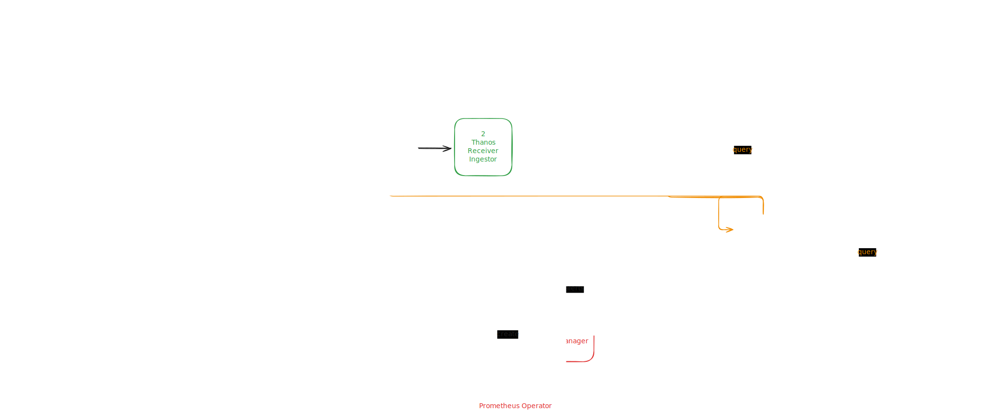

# Overview

{width=600}
///
Architecture Overview
///

!!! success "Metrics Collection Deployment Steps"

    - [x] Deploy a Prometheus Operator using YAML files
    - [ ] Deploy a Thanos using bitnami helm chart (Receiver, Store Gateway, Querier, Compactor, )
    - [ ] Deploy a Thanos ruler using Prometheus Operator
    - [ ] Deploy a Prometheus Alertmanager using Prometheus Operator
    - [ ] Deploy a OpenTelemetry Operator
    - [ ] Deploy a OpenTelemetry Collector using OpenTelemetry Operator
    - [ ] Deploy a Grafana using helm chart

```bash
cd ~/Projects/retail-lakehouse/observability
bash /install.sh
```

The `install.sh` script in the `observability` directory is as follows:

??? info "install.sh"

    ```bash
    --8<-- "./retail-lakehouse/observability/install.sh"
    ```


!!! success "Traces Collection Deployment Steps"

    - [ ] Deploy a Jaeger
    - [ ] Deploy a OpenTelemetry Collector
    - [ ] Trino jmx


