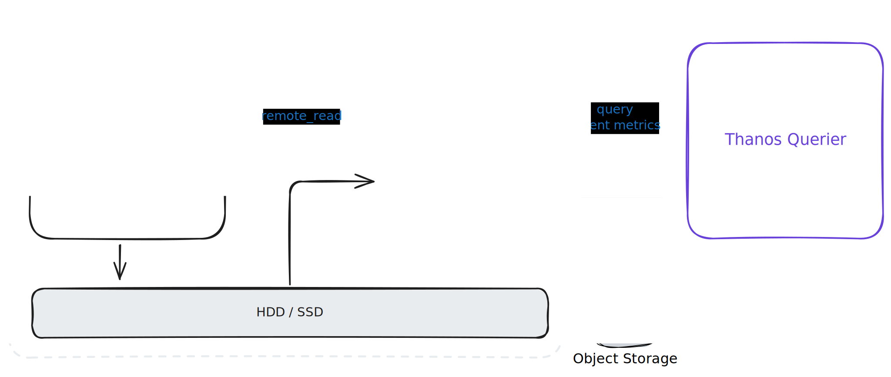
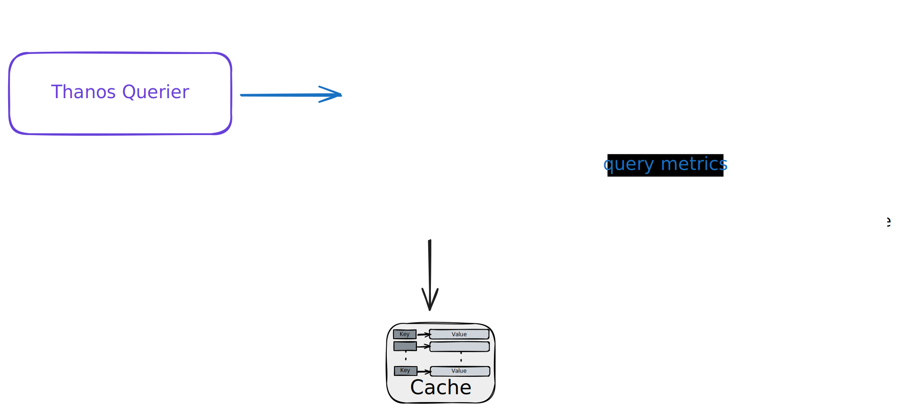
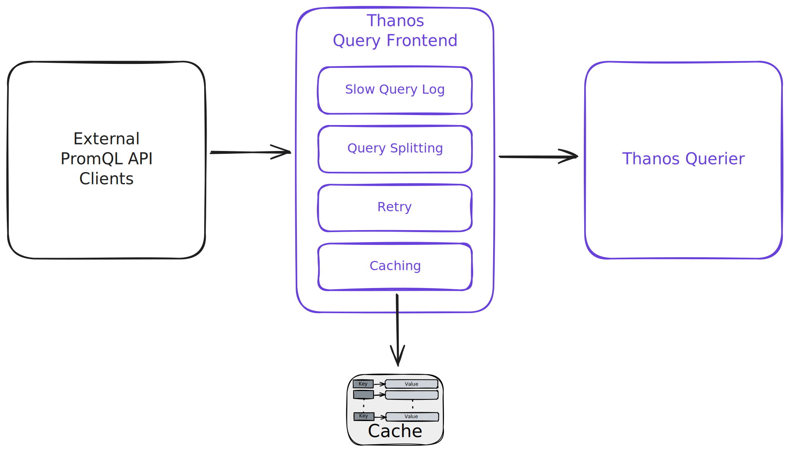
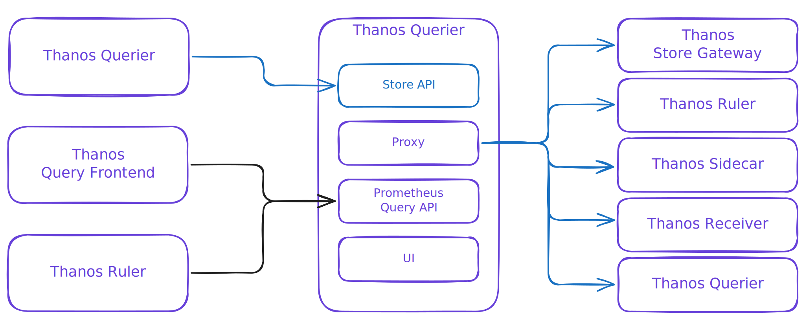
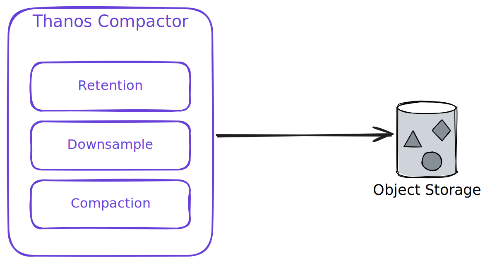
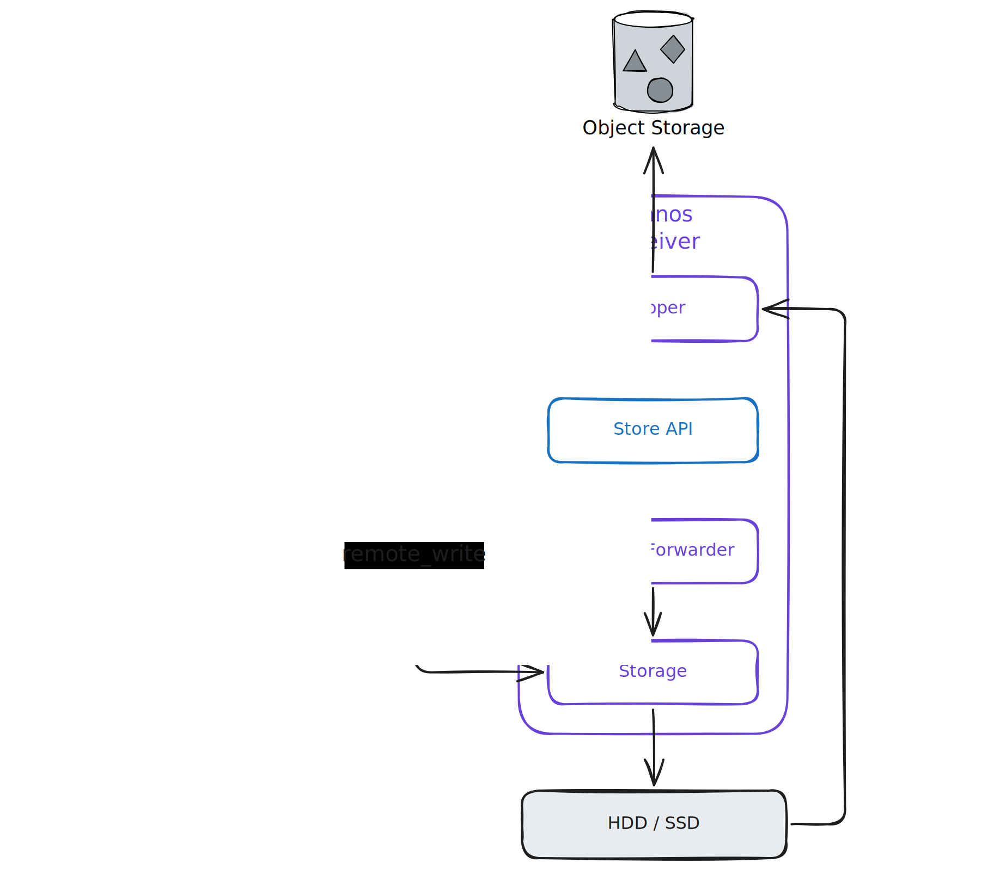

---
tags:
  - Prometheus
  - Thanos
  - SRE
---
# How Thanos Works?


## Architecture Overview

Thanos is comprised of a set of components where each fulfills a specific role:


### [*Sidecar*](https://thanos.io/tip/components/sidecar.md/)

Sidecar lays alongside each Prometheus instance and exposes Prometheus's data via **the Store API** for querying. It also uploads historical blocks to object storage.


/// caption
Thanos Sidecar
///

### [*Store Gateway*](https://thanos.io/tip/components/store.md/)

Store Gateway serves as a bridge between object storage and the Thanos cluster. It is a **stateless** and **horizontally scalable** component that exposes data stored in object storage via **the Store API** for querying. It can be deployed in multiple instances to provide high availability and load balancing.


/// caption
Thanos Store Gateway
///

### [*Query Frontend*](https://thanos.io/tip/components/query-frontend.md/)

Query Frontend is a **stateless** and **horizontally scalable** component that sits in front of the Querier(s) to provide **query splitting**, **caching**, and **rate limiting**.

{width=500}
/// caption
Thanos Query Frontend
///

### [*Querier*](https://thanos.io/tip/components/query.md/)

Querier is **stateless and horizontally scalable instances** that implement **PromQL** on top of **the Store API** exposed in the cluster. Queriers participate in the cluster to be able to **resiliently discover all data sources and store nodes**. It implements [Prometheus HTTP v1 API](https://prometheus.io/docs/prometheus/latest/querying/api/) to aggregate and  [deduplicate](https://thanos.io/tip/thanos/quick-tutorial.md/#deduplicating-data-from-prometheus-ha-pairs) data from multiple sources

{width=500}
/// caption
Thanos Querier
///


{width=500}
/// caption
[Metric Query Flow Overview](https://thanos.io/tip/components/query.md/#metric-query-flow-overview)
///


### [*Ruler*](https://thanos.io/tip/components/rule.md/)

Ruler **evaluates recording and alerting rules** against data in Thanos for exposition and/or upload. It can *discover query nodes* to evaluate recording and alerting rules.

{width=500}
/// caption
Thanos Ruler
///

### [*Compactor*](https://thanos.io/tip/components/compact.md/)

Compactor is a singleton process that does not participate in the Thanos cluster. Instead, it is only pointed at an object storage bucket and **continuously consolidates multiple smaller blocks into larger ones**. The compactor also does additional batch processing such as **down-sampling** and **applying retention policies**.

{width=500}
/// caption
Thanos Compactor
///

### [*Receiver*](https://thanos.io/tip/components/receive.md/)

Receiver receives data from Prometheus's `remote_write` WAL, exposes it, and/or uploads it to cloud storage. It also implements **the Store API**.

{width=500}
/// caption
Thanos Receiver
///


## FAQ

!!! question "Which Thanos components implement the Store API?"

    - **Sidecar**: it exposes Prometheus's data via the Store API for querying.
    - **Store Gateway**: it exposes data stored in object storage via the Store API for querying.
    - **Ruler**: it exposes its own data via the Store API for querying.
    - **Receiver**: although primarily a Prometheus `remote_write` receiver, it also implements the Store API.
    - **Querier**: if you need to support stacking multiple Querier instances, Querier also implements the Store API to allow one Querier to query another.

## K8S

There are 3 ways of deploying Thanos on Kubernetes:

- [Community Helm charts](https://artifacthub.io/packages/search?ts_query_web=thanos)
- [prometheus-operator](https://github.com/coreos/prometheus-operator)
- [kube-thanos](https://github.com/thanos-io/kube-thanos): Jsonnet based Kubernetes templates.

We use [kube-thanos](https://github.com/thanos-io/kube-thanos) to deploy Thanos components in this project.


## Deployment Patterns

There are two main deployment patterns for integrating Thanos with Prometheus, first is the *Sidecar* pattern, which let each Prometheus instance manage its own data and expose it to Thanos. The second is the *Receiver* pattern, which centralizes the reception of metrics from multiple Prometheus instances.


///caption
[Sidecar Pattern](https://thanos.io/tip/thanos/quick-tutorial.md/#components)
///


///caption
[Receiver Pattern](https://thanos.io/tip/thanos/quick-tutorial.md/#components)
///


!!! note

    - For a given Prometheus instance, it is **not recommended to run both Sidecar and Receiver simultaneously**.
    - Adopt **Sidecar pattern** if you want each Prometheus instance to **self-manage** while still allowing Querier to connect directly to each Prometheus for real-time data. It sits alongside Prometheus, exposing data to Thanos Querier and handling the upload of historical blocks to object storage.
    - Conversely, adopt **Receiver pattern** if you want to **centralize** the reception of metrics from multiple sources or tenants, making the front-end Prometheus instances lighter, or planning a centralized write pipeline, then using **Receiver** is more appropriate. It uses `remote_write` to accept data from each Prometheus and maintains a unified storage and query interface on the backend.

To learn more about more advanced deployment patterns, see [Multi-cluster monitoring with Thanos](https://www.cncf.io/blog/2021/03/15/multi-cluster-monitoring-with-thanos/) and [Stacking Thanos Queries](https://krisztianfekete.org/stacking-thanos-queries/) to understand multi-cluster setup and how to stack multiple Querier instances.

## Behind the Scenes

### Thanos Receiver Deep Dive

<iframe width="560" height="315" src="https://www.youtube.com/embed/jn_zIfBuUyE?si=OTRBxGMJg_j87tOc" title="YouTube video player" frameborder="0" allow="accelerometer; autoplay; clipboard-write; encrypted-media; gyroscope; picture-in-picture; web-share" referrerpolicy="strict-origin-when-cross-origin" allowfullscreen></iframe>
/// caption
Thanos Receiver Deep Dive - Joel Verezhak, Open Systems (2024)
///

<iframe width="560" height="315" src="https://www.youtube.com/embed/5MJqdJq41Ms?si=410RBLTt1Yb213M4" title="YouTube video player" frameborder="0" allow="accelerometer; autoplay; clipboard-write; encrypted-media; gyroscope; picture-in-picture; web-share" referrerpolicy="strict-origin-when-cross-origin" allowfullscreen></iframe>
/// caption
Turn It Up to a Million: Ingesting Millions of Metrics with Thanos Receive - Lucas Servén Marín
///

<iframe width="560" height="315" src="https://www.youtube.com/embed/Sgv0fqy_AZk?si=isOAwtGiRBue1k5G" title="YouTube video player" frameborder="0" allow="accelerometer; autoplay; clipboard-write; encrypted-media; gyroscope; picture-in-picture; web-share" referrerpolicy="strict-origin-when-cross-origin" allowfullscreen></iframe>
/// caption
Handling Billions of Metrics with Prometheus and Thanos - Ravi Hari & Amit Auddy, Intuit
///

### How Thanos Stores Data

- **Chunk Files**: hold a few hundred MB worth of chunks each. Chunks for the same series are sequentially aligned.
- **Index File**: holds all information needed to look up specific series
- `meta.json` File: holds meta-information about a block metadata

```
01BX6V6TY06G5MFQ0GPH7EMXRH
├── chunks
│   ├── 000001
│   ├── 000002
│   └── 000003
├── index
└── meta.json
```

See [Data in Object Storage](https://thanos.io/tip/thanos/storage.md/#data-in-object-storage) to understand how Thanos organizes data in object storage.


## References

- [Thanos | Prometheus Operator Docs](https://prometheus-operator.dev/docs/platform/thanos/)

