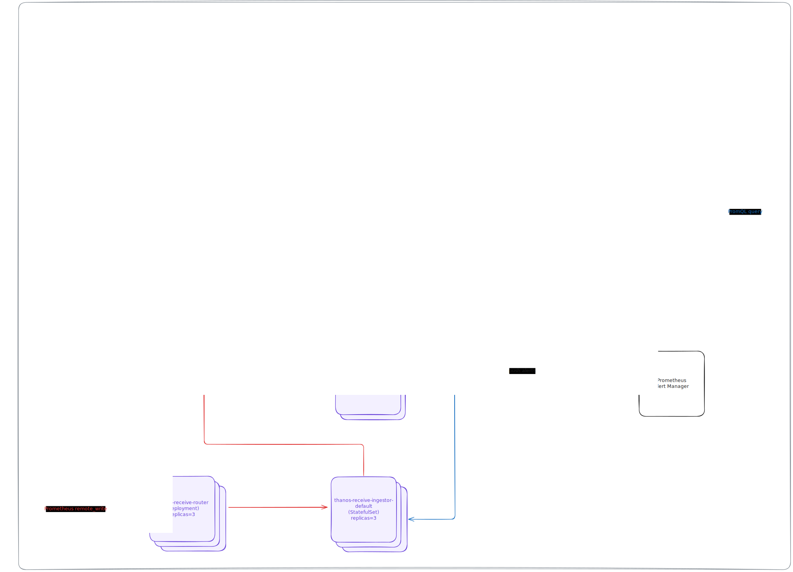

# Thanos Deployment


/// caption
Thanos Deployment Overview
///

We use [kube-thanos](https://github.com/thanos-io/kube-thanos) to deploy Thanos components in this project.


!!! warning

    When deploying Thanos in Kubernetes, Ruler would hit "too many open files" error. The reason is minikube's default `fs.inotify.max_user_instances` is `128`, which is too small. Hence we need to increase it.

    First, ssh into minikube VM:

    ```bash
    minikube -p retail-lakehouse ssh
    ```

    Inside minikube VM, check the current value of fs.inotify.max_user_instances, fs.inotify.max_user_watches, and file-max

    ```bash
    sysctl fs.inotify.max_user_watches
    sysctl fs.inotify.max_user_instances
    cat /proc/sys/fs/file-max
    ```

    Output should be like below:

    ```
    fs.inotify.max_user_watches = 1048576
    fs.inotify.max_user_instances = 128
    9223372036854775807
    ```

    Increase `fs.inotify.max_user_instances` to `1024` by running the following command:

    ```bash
    sudo sysctl -w fs.inotify.max_user_instances=1024
    ```

    After that, you can exit minikube VM:

    ```bash
    exit
    ```

```bash
./install.sh
```

This shell script will install Thanos components in `thanos` namespace. Specifically, it will install:

1. Prometheus Operator
2. Cert Manager
3. OpenTelemetry Operator
4. Jaeger v2 using OpenTelemetry Operator for tracing
5. Thanos components using kube-thanos jsonnet (excdpt Thanos Ruler)
6. Prometheus Alertmanager and Thanos Ruler using Prometheus Operator

??? note "thanos/install.sh"

    ```shell linenums="1"
    --8<-- "thanos/install.sh"
    ```

??? note "thanos/thanos.jsonnet"

    ```jsonnet linenums="1"
    --8<-- "thanos/thanos.jsonnet"
    ```

## References

- [Community Thanos Kubernetes Applications | Thanos Docs](https://thanos.io/tip/thanos/getting-started.md/#community-thanos-kubernetes-applications) 