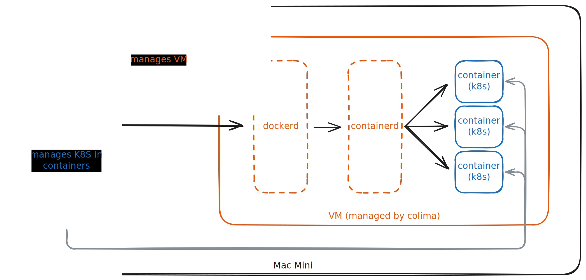

# Prerequisites

For this project, I use a Mac mini (2024) with the following specifications:

- Apple M4 chip
- 10-core CPU
- 10-core GPU
- 16-core Neural Engine
- 32GB RAM
- 512GB SSD

## Installing Required Tools via Homebrew

Make sure you have [Homebrew](https://brew.sh/) installed. Then install the required tools:

```
brew install colima, docker, kubectl, minikube, helm, openjdk@21
```

## Setting Up a Local Kubernetes Cluster

Start colima with more resources:

```bash
colima start \
    --cpu 9 \
    --memory 24 \
    --disk 120 \
    --runtime docker \
    --profile data
```

This will create a local VM with docker runtime. After installing colima, make sure `docker` uses the colima context (`docker context ls`).

Then start minikube with more resources:

```bash
minikube start \
  --profile retail-lakehouse \
  --nodes 3 \
  --cpus 3 \
  --memory 8G \
  --disk-size 40G \
  --driver docker \
  --container-runtime docker \
  --kubernetes-version v1.30.2 \
  --addons registry \
  --insecure-registry "10.0.0.0/24" \
  --delete-on-failure
```

This will create a 3-node Kubernetes cluster (3 CPUs, 8GB RAM, 40GB disk each) with a local container registry addon enabled. The `--insecure-registry` flag allows pushing images to the local registry.


///
K8s Cluster Environment
///
