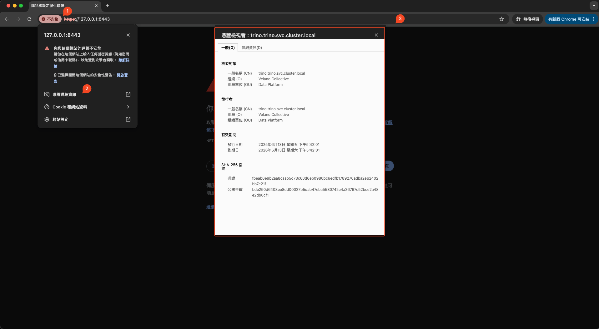
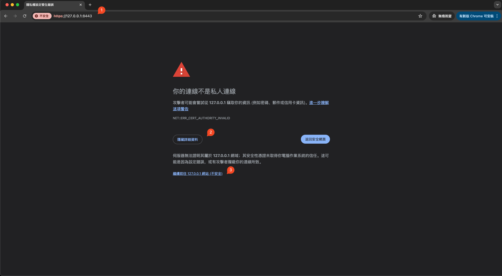
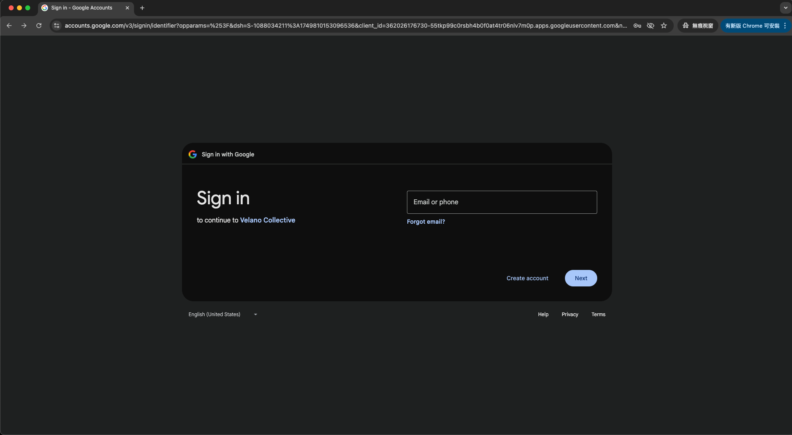
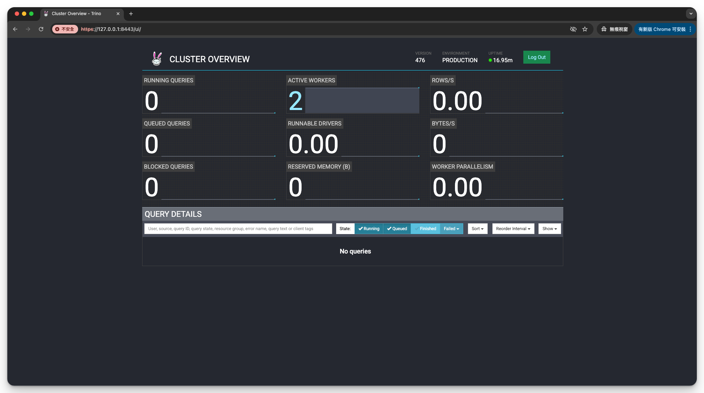

# Trino Cluster Deployment

!!! success "Prerequisites"

  - [ ] Complete all the requirements in the [Prerequisites](../prerequisites.md) section.
  - [ ] OAuth 2.0 Client ID and Client Secret (`OAUTH2_CLIENT_ID` and `OAUTH2_CLIENT_SECRET`) for Google authentication. See [here](./oauth2.md#create-google-oauth-20-client) for instructions.
  - [ ] GCP service account path in your local machine (`GCP_SA_INPUT_PATH`) for accessing BigQuery Datasets under your GCP project (`GCP_PROJECT_ID`). See [here](./catalogs.md#bigquery) for instructions.
  - [ ] AWS credentials (`AWS_ACCESS_KEY` and `AWS_SECRET_KEY`), regions (`AWS_REGION`), and S3 bucket (`ICEBERG_S3_URL`) for accessing Iceberg table and Glue Data Catalog. See [here](./catalogs.md#iceberg) for instructions.
  - [ ] AWS S3 Bucket for Exchange Manager (`EXCHANGE_S3_URLS`). See [here](./fault-tolerance.md) for instructions.

Without further ado, let's get started with the deployment:

```bash
cd ~/Projects/retail-lakehouse/trino
bash install.sh
```

The installation script `install.sh` will perform the following steps:

1. Generate `.env` and `values.yaml` files
2. Create the `trino` namespace.
3. Generate TLS certificates and create the Kubernetes secret.
4. Generate the BigQuery service account secret and create the Kubernetes secret.
5. Install Trino using Helm with the generated `values.yaml`.

??? info "install.sh"

    ```bash
    --8<-- "./retail-lakehouse/trino/install.sh"
    ```

For the script to work correctly, you need to set the following environment variables during the execution of the script. Another option is to set them in a `.env` file in the same directory as the script.

??? info ".env"

    - `INTERNAL_SHARED_SECRET`: A secret string for internal communication security between Trino nodes. Used as `internal-communication.shared-secret`.

    - `OAUTH2_CLIENT_ID`: The client ID for OAuth 2.0 authentication, used to enable Google login for the Trino Web UI. Referenced as `http-server.authentication.oauth2.client-id`.

    - `OAUTH2_CLIENT_SECRET`: The client secret for OAuth 2.0 authentication, paired with the client ID for secure login. Used as `http-server.authentication.oauth2.client-secret`.

    - `GCP_BQ_PROJECT_ID`: The Google Cloud project ID, required for the BigQuery connector in Trino. Used as `bigquery.project-id`.

    - `GCP_SA_INPUT_PATH`: Path to the service account JSON file for Google Cloud authentication. Used to create the BigQuery service account K8S secret.

    - `AWS_ACCESS_KEY`: AWS access key for authenticating to AWS services (S3, Glue, etc.). Used for S3 and Glue access, and for exchange manager S3 configuration.

    - `AWS_SECRET_KEY`: AWS secret key, paired with the access key for AWS authentication. Used for S3, Glue, and exchange manager S3 configuration.

    - `AWS_REGION`: The AWS region where your S3 buckets and Glue Data Catalog are located. Used for S3, Glue, and exchange manager S3 configuration.

    - `ICEBERG_S3_URL`: The S3 URL (bucket path) for storing Iceberg table data. Used as `hive.metastore.glue.default-warehouse-dir`.

    - `EXCHANGE_S3_URLS`: S3 URLs for Trino's exchange manager, which handles intermediate data during distributed query execution. Used as `exchangeManager.baseDir`.

    These variables are substituted into the Trino Helm values file and Kubernetes secrets using `envsubst` to configure authentication, storage, and cloud integration for your Trino deployment.

If you don't like my script and want to do it step by step manually, please continue reading. This article will walk you through how to deploy a Trino Cluster on Kubernetes step by step, explaining each part along the way.


## Generating Environment and Values Files

```bash title="install.sh:env"
--8<-- "./retail-lakehouse/trino/install.sh:env"
```

??? info "generate-env.sh"

    ```bash
    --8<-- "./retail-lakehouse/trino/generate-env.sh"
    ```

## Loading environment variables from the `.env` file

Load the environment variables from the `.env` file so that they can be used in subsequent commands:

```bash
source ".env"
```

## Creating the Namespace

Create the trino namespace, which is where we deploy our Trino cluster:

```bash
kubectl create namespace trino
```

??? info "Result"

    ```
    namespace/trino created
    ```

## Setting up TLS Certificates

Execute `generate-tls-certs.sh` to generate TLS certificate and Kubernetes secret and then apply the secret to the `trino` namespace:

```bash title="install.sh:tls"
--8<-- "./retail-lakehouse/trino/install.sh:tls"
```

??? info "Result"

    ```
    Creating TLS certificates for Trino...
    Step 1: Creating Private Key...
    Step 1: Completed.
    Step 2: Creating Certificate...
    Step 2: Completed.
    Step 3: Combining Private Key and Certificate...
    Step 3: Completed.
    Step 4: Creating Kubernetes secret...
    Step 4: Completed.
    Certificate generation completed successfully!

    Generated files:
      - {==.cert/trino-dev.pem==} (with private key and certificate)
      - {==trino-tls-secret.yaml==} (Kubernetes secret manifest)

    {==secret/trino-tls-secret created==}
    ```

Once executed, the `trino-tls-secret.yaml` file will have the following structure:

??? info "trino-tls-secret.yaml"

    ```yaml
    apiVersion: v1
    kind: Secret
    metadata:
      creationTimestamp: null
      name: trino-tls-secret
    data:
      {==trino-dev.pem==}: xxx
    ```

## Configuring BigQuery Service Account

Generate the BigQuery service account secret manifest file and apply it to the `trino` namespace:

```bash title="install.sh:bq"
--8<-- "./retail-lakehouse/trino/install.sh:bq"
```

??? info "Result"

    ```
    Generating Kubernetes secret for Accessing BigQuery...
    trino-bigquery-secret.yaml generated successfully.
    {==secret/trino-bigquery-secret created==}
    ```

Once executed, the `trino-bigquery-secret.yaml` file will have the following structure:

??? info "trino-bigquery-secret.yaml"

    ```yaml
    apiVersion: v1
    kind: Secret
    metadata:
      creationTimestamp: null
      name: trino-bigquery-secret
    data:
      {==trino-sa.json==}: xxx
    ```

## Installing Trino

First, add and update the Trino Helm repository. Then, deploy Trino in the `trino` namespace using the generated `values.yaml` file:

```bash title="install.sh:bq"
--8<-- "./retail-lakehouse/trino/install.sh:helm"
```

??? info "Result"

    ```
    NAME: trino
    LAST DEPLOYED: Fri Jun 13 17:49:52 2025
    NAMESPACE: trino
    STATUS: {==deployed==}
    REVISION: 1
    NOTES:
    Get the application URL by running these commands:
      kubectl --namespace trino port-forward svc/trino 8080:8080
      echo "Visit http://127.0.0.1:8080 to use your application"
    ```

## Verifying the Deployment

After the installation completes, verify that Trino has been deployed successfully. Show the deployed Trino release:

```bash
helm list -n trino
```

??? info "Result"

    ```
    NAME    NAMESPACE       REVISION        UPDATED                                 STATUS          CHART           APP VERSION
    trino   trino           1               2025-06-13 18:08:54.435442 +0800 CST    {==deployed==}        trino-1.39.1    475    
    ```

Then, check the status of all resources in the `trino` namespace:

```bash
kubectl get all -n trino
```

??? info "Result"

    ```
    NAME                                     READY   STATUS    RESTARTS   AGE
    pod/trino-coordinator-6fdfb7bf84-tjwfc   1/1     {==Running==}   0          5m38s
    pod/trino-worker-777d595c66-dml67        1/1     {==Running==}   0          5m38s
    pod/trino-worker-777d595c66-pv9h2        1/1     {==Running==}   0          5m38s

    NAME                   TYPE        CLUSTER-IP      EXTERNAL-IP   PORT(S)             AGE
    service/trino          ClusterIP   10.99.208.168   <none>        8080/TCP,{==8443/TCP==}   5m38s
    service/trino-worker   ClusterIP   None            <none>        8080/TCP            5m38s

    NAME                                READY   UP-TO-DATE   AVAILABLE   AGE
    deployment.apps/trino-coordinator   1/1     1            1           5m38s
    deployment.apps/trino-worker        2/2     2            2           5m38s

    NAME                                           DESIRED   CURRENT   READY   AGE
    replicaset.apps/trino-coordinator-6fdfb7bf84   1         1         1       5m38s
    replicaset.apps/trino-worker-777d595c66        2         2         2       5m38s
    ```

Perfect! The deployment is successful. As you can see, the Trino coordinator and worker pods are up and running, and all services have been created correctly. With the cluster now operational, we can proceed to access the *Trino Web UI* and *Trino CLI* to interact with the cluster.


### Web UI

To access the Trino Web UI, start by port-forwarding the Trino service to your local machine:

```bash
kubectl port-forward svc/trino 8443:8443 --namespace trino
```

Once the port forwarding is active, open your browser and navigate to `https://127.0.0.1:8443`. Since we're using a self-signed certificate for development purposes, your browser will display a security warning. This is expected behavior and safe to bypass in a development environment.

To proceed, click **"Advanced"** and then **"Accept the Risk and Continue"** (the exact wording may vary depending on your browser).





Since OAuth 2.0 authentication is enabled, you'll be automatically redirected to the Google login page for authentication.



After logging in with your Google account, you will be redirected back to the Trino Web UI.



Once authenticated successfully, you'll be redirected back to the Trino Web UI where you can monitor queries, view cluster status, and manage your Trino environment.

### Trino CLI

For command-line access to Trino, you'll need to download and install the Trino CLI tool.

First, download the [`trino-cli-476-executable.jar`](https://repo1.maven.org/maven2/io/trino/trino-cli/476/trino-cli-476-executable.jar) file from the [Maven repository](https://repo1.maven.org/maven2/io/trino/trino-cli/).

Next, rename the file to `trino`, make it executable, and move it to a directory in your PATH (such as `/usr/local/bin`):

```bash
cd ~/Projects/retail-lakehouse/trino
curl -L -o trino-cli-476-executable.jar https://repo1.maven.org/maven2/io/trino/trino-cli/476/trino-cli-476-executable.jar
chmod +x trino-cli-476-executable.jar
sudo mv trino-cli-476-executable.jar /usr/local/bin/trino
```

Verify the installation by checking the version:

```bash
trino --version
```

??? info "Result"

    ```
    Trino CLI 476
    ```

To connect to your Trino cluster, use the CLI with [external authentication](https://trino.io/docs/current/client/cli.html#external-authentication-sso) enabled:

```bash
trino --server https://127.0.0.1:8443 \
      --external-authentication \
      --insecure \
      --user "user@example.com"
```

??? tip "Authentication Flow"

    The CLI authentication process works as follows:

    - Start the CLI with the `--external-authentication` option and execute a query.
    - The CLI starts and connects to Trino.
    - A message appears in the CLI directing you to open a browser with a specified URL when the first query is submitted.
    - Open the URL in a browser and follow through the authentication process.
    - The CLI automatically receives a token.
    - When successfully authenticated in the browser, the CLI proceeds to execute the query.
    - Further queries in the CLI session do not require additional logins while the authentication token remains valid. Token expiration depends on the external authentication type configuration.
    - Expired tokens force you to log in again.

    This authentication method ensures secure access to your Trino cluster while maintaining ease of use for interactive queries.

## Cleanup

To remove the Trino cluster:

```bash
helm uninstall trino --namespace trino
kubectl delete namespace trino
```