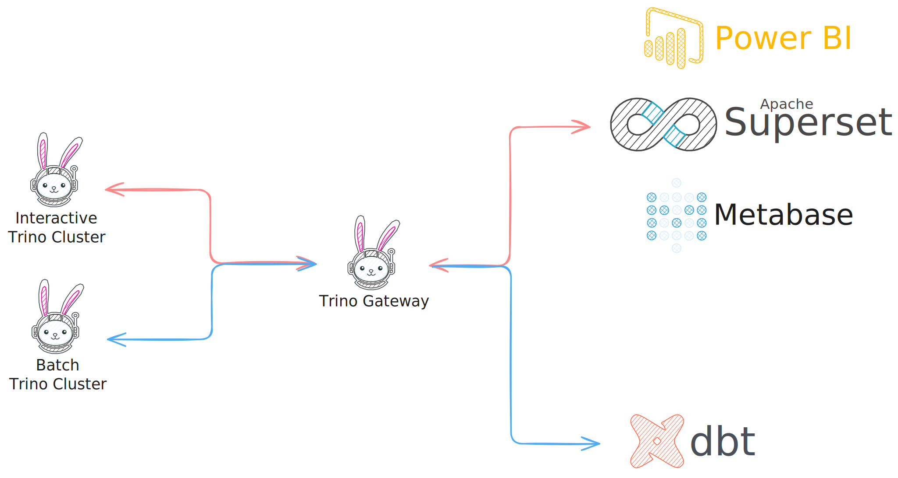

---
tags:
  - Trino
---

# Fault-tolerant Execution in Trino

By default, when a Trino node experiences resource constraints or encounters failures while processing a query, the entire query fails and requires manual restart.

Fault-tolerant execution is a feature in Trino that helps clusters recover from query failures **by automatically retrying failed queries or their individual tasks**. When this capability is enabled, **intermediate data exchanges are cached and stored**, allowing other workers to reuse this data if a worker node fails or encounters issues during query execution.

<figure markdown="span">
  {width="500"}
  *Fault-tolerant Trino Cluster*
</figure>


This allows Trino to handle larger queries such as **batch operations** without worker node interruptions causing the query to fail.

**The coordinator node** uses a configured exchange manager service that **buffers data during query processing in an external location**, such as an S3 object storage bucket. 

**Worker nodes send data to the buffer as they execute their query tasks.**

## Configuration

To enable fault-tolerant execution, you need to configure the Trino cluster with the following properties:

```yaml title="value.yaml" linenums="1" hl_lines="1 17-19"
--8<-- "./retail-lakehouse/trino/values-template.yaml:server"
```

```yaml title="value.yaml" linenums="1" hl_lines="1 3"
--8<-- "./retail-lakehouse/trino/values-template.yaml:additionalConfigProperties"
```

```yaml title="value.yaml" linenums="1" hl_lines="1-4"
--8<-- "./retail-lakehouse/trino/values-template.yaml:additionalExchangeManagerProperties"
```

The three configuration blocks shown above are **applied to both the coordinator and all worker nodes** in the Trino cluster.


## Considerations

**When fault-tolerant execution is enabled on a cluster, write operations will fail on any catalogs that do not support fault-tolerant execution of those operations**. **This design ensures data consistency and prevents partial writes that could occur during query retries**. Since fault-tolerant execution may retry failed tasks multiple times, write operations must be **idempotent** to avoid duplicate data or corrupted states. Catalogs that cannot guarantee idempotent writes are therefore excluded to maintain data integrity.

Furthermore, it is recommended to run a **dedicated fault-tolerant cluster** for handling batch operations, separate from a cluster designated for higher query volume. This separation provides several key benefits: **workload isolation** prevents long-running batch jobs from affecting interactive queries, **resource optimization** allows each cluster to be tuned for its specific use case, and **fault tolerance overhead** (such as external storage I/O) doesn't impact performance-sensitive interactive workloads.

Additionally, when configuring fault-tolerant execution, you can **configure multiple storage locations** for use by the exchange manager to **help balance the I/O load between them**. The exchange manager may send a large amount of data to the exchange storage, resulting in high I/O load on that storage. **By distributing data across multiple storage endpoints, you can prevent storage bottlenecks and improve overall query performance during fault recovery scenarios.**

## Dual Cluster Architecture

<figure markdown="span">
  
</figure>

In practice, a common enterprise configuration involves deploying **two distinct Trino clusters**: an **interactive cluster for ad-hoc queries and dashboard updates**, and a **batch cluster for long-running, compute-intensive, or large-scale shuffle operations**. This dual-cluster architecture can be orchestrated through **Trino Gateway**, which intelligently routes queries to the most appropriate cluster based on query characteristics and workload requirements.

### Interactive Cluster

The **interactive cluster** operates with **fault-tolerant execution disabled**, prioritizing **low latency and high concurrency** for user-facing analytics. This cluster excels at handling ad-hoc analysis, visualization tool queries, report generation, dashboard updates, cross-table joins, and data exploration tasks. These queries typically involve **small to medium datasets with response times measured in seconds to tens of seconds**. By avoiding external exchange storage, this cluster eliminates additional I/O overhead and latency, though it requires full query restart when node failures occur.

### Batch Cluster

Conversely, the **batch cluster enables fault-tolerant execution** with a configured exchange manager that stores intermediate results in external storage, supporting **staged retry capabilities** after node failures. This cluster handles long-running, compute-intensive, or large-scale shuffle queries such as bulk data transformations, historical data recomputation, large-scale joins, aggregation computations, data compaction and sorting, and feature generation for model training. While the external exchange mechanism enables resilience against single node failures, **it incurs higher I/O and storage costs, making it unsuitable for high-volume small queries**.

### Trino Gateway

Finally, **Trino Gateway** orchestrates query routing between the clusters, ensuring **optimal resource utilization**. **Interactive queries and dashboard requests** are directed to the **interactive cluster** for guaranteed low latency and high concurrency, while **batch jobs and data pipeline operations are routed to the batch cluster for fault tolerance and large-scale processing capabilities**. This division of labor ensures that different workload types execute in their most suitable environments while minimizing resource contention and performance conflicts.

## References

- [Improve query processing resilience](https://trino.io/docs/current/installation/query-resiliency.html)
- [Fault-tolerant execution](https://trino.io/docs/current/admin/fault-tolerant-execution.html)
