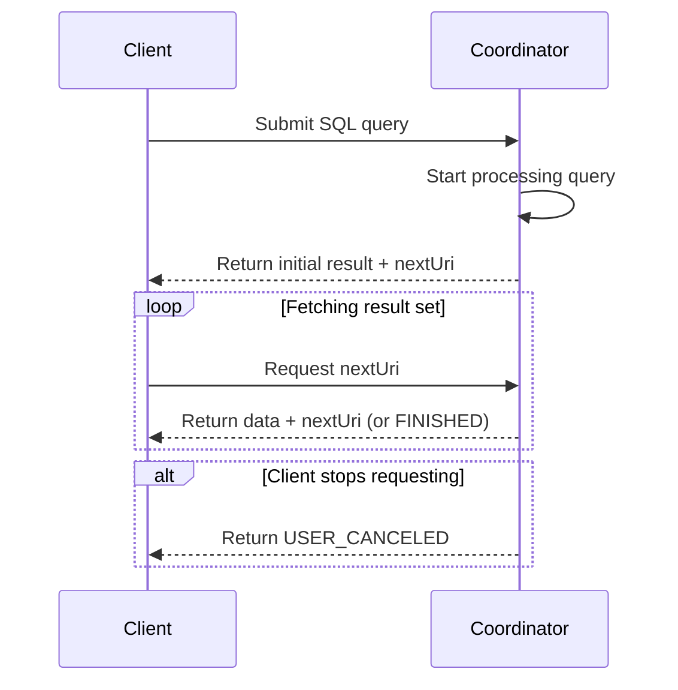

---
tags:
  - Trino
---
# How It Works?

## Key Modules and Their Roles

## Architecture Components

### Coordinator

The Trino coordinator is the server that is responsible for **parsing statements**, **planning queries**, and **managing Trino worker nodes**. It is also the node to which a client connects to submit statements for execution. The coordinator keeps track of the activity on each worker and coordinates the execution of a query. The coordinator creates a logical model of a query involving a series of stages, which is then translated into a series of connected tasks running on a cluster of Trino workers. Coordinators communicate with workers and clients using a REST API. The coordinator is responsible for fetching results from the workers and returning the final results to the client.

### Worker

A Trino worker is a server that is responsible for executing tasks and processing data. Worker nodes fetch data from connectors and exchange intermediate data with each other. When a Trino worker process starts up, it advertises itself to the discovery server in the coordinator, which makes it available to the Trino coordinator for task execution.

### Cluster

: A Trino cluster consists of several Trino nodes - one coordinator and zero or more workers. The coordinator and the workers access the connected *data sources*. This access is configured in *catalogs*.

### Clients

Clients allow you to connect to Trino, submit SQL queries, and receive the results. Clients can access all configured data sources using *catalogs*. 

Client Drivers:  The Trino project maintains the following client drivers:

- Trino JDBC driver
- trino-go-client
- trino-js-client
- trino-python-client
- trino-csharp-client

Client Applications: The Trino project maintains the [Trino command line interface](https://trino.io/docs/current/client/cli.html) and the [Trino Grafana Data Source Plugin](https://github.com/trinodb/grafana-trino) as a client application.

All client drivers and client applications communicate with the Trino coordinator using the client protocol.

The Trino client protocol is a HTTP-based protocol that allows clients to submit SQL queries and receive results.

The protocol is a sequence of REST API calls to the coordinator of the Trino cluster.

## Core Concepts

### Data Sources

Trino is a query engine that you can use to query many different data sources. They include data lakes and lakehouses, numerous relational database management systems, key-value stores, and many other data stores.

Configure a catalog with the required Trino connector for the specific data source to access the data.

### Connectors

A connector adapts Trino to a data source such as a data lake using Hadoop/Hive or Apache Iceberg, or a relational database such as PostgreSQL.

You can think of a connector the same way you think of a driver for a database. It is an implementation of Trino’s service provider interface (SPI), which allows Trino to interact with a resource using a standard API.

### Catalogs

Every catalog uses a specific connector

If you examine a catalog configuration file, you see that each contains a mandatory property connector.name with the value identifying the connector.

A Trino catalog is a collection of configuration properties used to access a specific data source, including the required connector and any other details such as credentials and URL.

Catalogs are defined in properties files stored in the Trino configuration directory.

You can configure and use many catalogs, with different or identical connectors, to access different data sources.

A catalog contains one or more schemas, which in turn contain objects such as tables, views, or materialized views.

## Behind the Scenes

### Query Execution Model

A user starts by sending an SQL ***statement*** from a client tool—such as DBeaver, Superset, or a custom application—to the Trino cluster. This ***statement*** is a plain-text command like `SELECT region, COUNT(*) FROM sales GROUP BY region;`. It first arrives at the ***coordinator***, which is the brain of the Trino system.

The ***coordinator*** begins by parsing this ***statement***, checking for syntax and semantic correctness. Once validated, the ***statement*** is transformed into a ***query***. This ***query*** is more than just text—it’s a fully-formed plan that defines how the cluster will execute the user’s command. The ***query*** is broken down into a hierarchy of ***stages***, forming a distributed execution plan. These ***stages*** form a tree-like structure, where each ***stage*** represents a logical step of the query, such as scanning data, performing aggregation, or returning final results.

Although ***stages*** define what needs to be done, they don’t perform the actual computation. Instead, each ***stage*** is implemented through multiple ***tasks***. These ***tasks*** are distributed across ***worker*** nodes in the cluster. Each ***task*** is responsible for executing a portion of its parent ***stage***, and together, the tasks accomplish the overall goal of that stage.

Each ***task*** works on specific chunks of data called ***splits***. A ***split*** is a subset of the overall dataset—for example, a single Parquet file or a segment of rows. The ***coordinator*** asks the storage connector (such as the Hive connector) for a list of available ***splits*** for a given table and then assigns those ***splits*** to the ***tasks*** running on various workers.

Within each ***task***, the execution is further broken down into one or more ***drivers***. A ***driver*** is essentially a data pipeline that runs in a single thread. Each ***driver*** consists of a series of ***operators***. These ***operators*** perform concrete operations like scanning a table, filtering rows, applying functions, or aggregating values. You can think of a ***driver*** as a physical pipeline built from ***operator*** components.

For example, a ***driver*** in this case might include a ***table scan operator*** that reads rows from the `sales` table, followed by a ***filter operator*** that removes NULL regions, and an ***aggregation operator*** that performs the `GROUP BY region` logic.

As data flows upward from lower ***stages*** to higher ones, ***exchanges*** come into play. These are the network mechanisms that transfer data between nodes. When one ***stage*** finishes processing, it places its output into buffers. The next ***stage*** pulls data from these buffers using an ***exchange client***, ensuring the distributed stages stay connected even across physical nodes.

Once the root ***stage*** finishes aggregating the results from its child stages, the final output is assembled by the ***coordinator*** and returned to the client. What the user sees is a neatly formatted result set with regions and counts, but under the hood, that simple output is the product of a highly parallel and distributed pipeline involving ***statements***, ***queries***, ***stages***, ***tasks***, ***splits***, ***drivers***, ***operators***, and ***exchanges***.

### Clients

The protocol is a sequence of REST API calls to the coordinator of the Trino cluster. Following is a high-level overview:

1. Client submits SQL query text to the coordinator of the Trino cluster.
2. The coordinator starts processing the query.
3. The coordinator returns a result set and a URI `nextUri` on the coordinator.
4. The client receives the result set and initiates another request for more data from the URI `nextUri`.
5. The coordinator continues processing the query and returns further data with a new URI.
6. The client and coordinator continue with steps 4. and 5. until all result set data is returned to the client or the client stops requesting more data.
7. If the client fails to fetch the result set, the coordinator does not initiate further processing, fails the query, and returns a `USER_CANCELED` error.
8. The final response when the query is complete is `FINISHED`.
