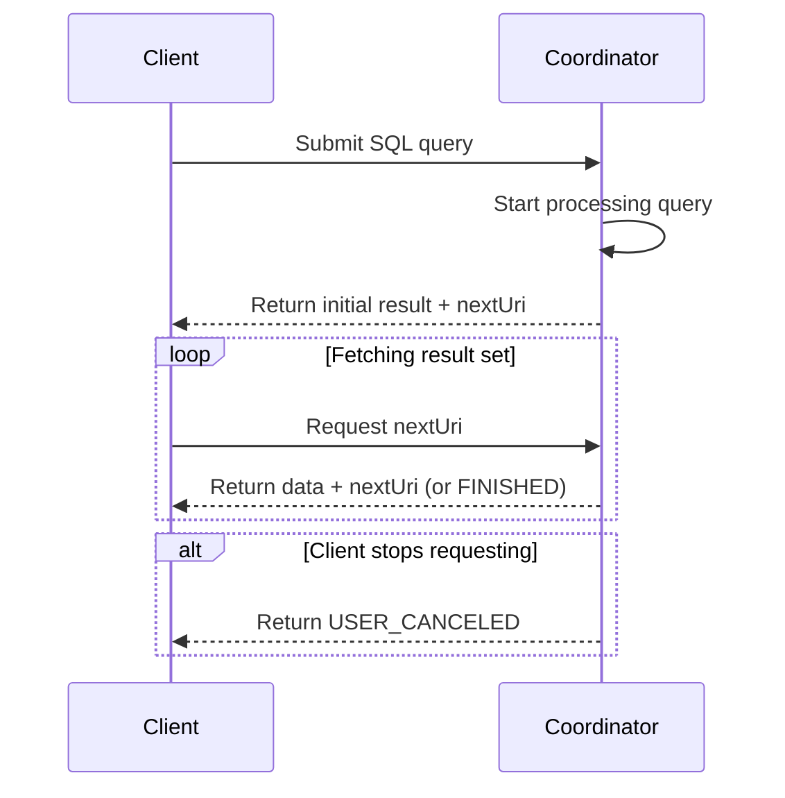

---
tags:
  - Trino
---
# How It Works?

## Architecture Components

### Coordinator

: The Trino coordinator is the server that is responsible for **parsing statements**, **planning queries**, and **managing Trino worker nodes**. It is also the node to which a client connects to submit statements for execution. The coordinator keeps track of the activity on each worker and coordinates the execution of a query. The coordinator creates a logical model of a query involving a series of stages, which is then translated into a series of connected tasks running on a cluster of Trino workers. Coordinators communicate with workers and clients using a REST API. The coordinator is responsible for fetching results from the workers and returning the final results to the client.

### Worker

: A Trino worker is a server that is responsible for executing tasks and processing data. Worker nodes fetch data from connectors and exchange intermediate data with each other. When a Trino worker process starts up, it advertises itself to the discovery server in the coordinator, which makes it available to the Trino coordinator for task execution.

### Cluster

: A Trino cluster consists of several Trino nodes - one coordinator and zero or more workers. The coordinator and the workers access the connected *data sources*. This access is configured in *catalogs*.

### Clients

: Clients allow you to connect to Trino, submit SQL queries, and receive the results. Clients can access all configured data sources using *catalogs*. 

## Core Concepts

### Data Sources

Trino serves as a distributed query engine capable of accessing a wide variety of data sources. These encompass data lakes, lakehouses, various relational database management systems, key-value stores, and numerous other storage systems.

To enable data access, you must configure a catalog with the appropriate Trino connector tailored to your specific data source.

### Connectors

Connectors serve as adapters that enable Trino to interface with various data sources, including data lakes built on Hadoop/Hive or Apache Iceberg, as well as relational databases like PostgreSQL.

Think of connectors similarly to database drivers—they are concrete implementations of Trino's service provider interface (SPI) that provide a standardized way for Trino to communicate with external resources through a consistent API.

### Catalogs

A catalog in Trino represents a configuration that enables access to a specific data source through a designated connector. Each catalog is defined by a collection of properties stored in configuration files within the Trino configuration directory.

The fundamental requirement for any catalog is the `connector.name` property, which specifies which connector implementation to use for that particular data source. Beyond the connector specification, catalogs also include additional configuration details such as authentication credentials, connection URLs, and other source-specific parameters.

**Multiple catalogs can be configured simultaneously**, allowing Trino to connect to various data sources. These catalogs may utilize different connector types or even multiple instances of the same connector type to access distinct data sources.

**Within each catalog's scope, you'll find a hierarchical structure consisting of schemas**. These schemas serve as organizational containers for database objects including tables, views, and materialized views, providing a logical grouping mechanism for the data accessible through that catalog.

## Behind the Scenes

### Query Execution Model

A user starts by sending an SQL ***statement*** from a client tool—such as DBeaver, Superset, or a custom application—to the Trino cluster. This ***statement*** is a plain-text command like `SELECT region, COUNT(*) FROM sales GROUP BY region;`. It first arrives at the ***coordinator***, which is the brain of the Trino system.

The ***coordinator*** begins by parsing this ***statement***, checking for syntax and semantic correctness. Once validated, the ***statement*** is transformed into a ***query***. This ***query*** is more than just text—it’s a fully-formed plan that defines how the cluster will execute the user’s command. The ***query*** is broken down into a hierarchy of ***stages***, forming a distributed execution plan. These ***stages*** form a tree-like structure, where each ***stage*** represents a logical step of the query, such as scanning data, performing aggregation, or returning final results.

Although ***stages*** define what needs to be done, they don’t perform the actual computation. Instead, each ***stage*** is implemented through multiple ***tasks***. These ***tasks*** are distributed across ***worker*** nodes in the cluster. Each ***task*** is responsible for executing a portion of its parent ***stage***, and together, the tasks accomplish the overall goal of that stage.

Each ***task*** works on specific chunks of data called ***splits***. A ***split*** is a subset of the overall dataset—for example, a single Parquet file or a segment of rows. The ***coordinator*** asks the storage connector (such as the Hive connector) for a list of available ***splits*** for a given table and then assigns those ***splits*** to the ***tasks*** running on various workers.

Within each ***task***, the execution is further broken down into one or more ***drivers***. A ***driver*** is essentially a data pipeline that runs in a single thread. Each ***driver*** consists of a series of ***operators***. These ***operators*** perform concrete operations like scanning a table, filtering rows, applying functions, or aggregating values. You can think of a ***driver*** as a physical pipeline built from ***operator*** components.

For example, a ***driver*** in this case might include a ***table scan operator*** that reads rows from the `sales` table, followed by a ***filter operator*** that removes NULL regions, and an ***aggregation operator*** that performs the `GROUP BY region` logic.

As data flows upward from lower ***stages*** to higher ones, ***exchanges*** come into play. These are the network mechanisms that transfer data between nodes. When one ***stage*** finishes processing, it places its output into buffers. The next ***stage*** pulls data from these buffers using an ***exchange client***, ensuring the distributed stages stay connected even across physical nodes.

Once the root ***stage*** finishes aggregating the results from its child stages, the final output is assembled by the ***coordinator*** and returned to the client. What the user sees is a neatly formatted result set with regions and counts, but under the hood, that simple output is the product of a highly parallel and distributed pipeline involving ***statements***, ***queries***, ***stages***, ***tasks***, ***splits***, ***drivers***, ***operators***, and ***exchanges***.

### Client Protocol

See [Client Protocol | Trino](https://trino.io/docs/current/client/client-protocol.html) for more.
