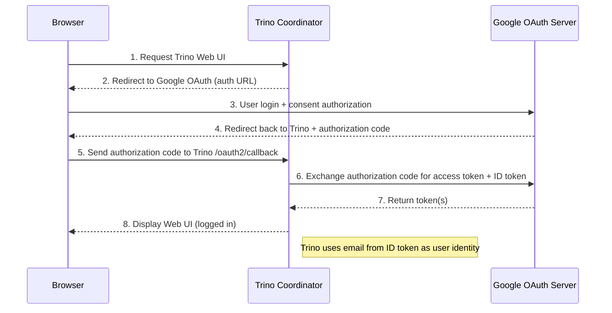

---
tags:
  - Trino
---
# Configure OAuth 2.0 Authentication

To implement OAuth 2.0 authentication with HTTPS support for both Trino's Web UI and JDBC driver connections, two main configuration areas must be addressed:

- [**TLS/HTTPS Configuration**](https://trino.io/docs/current/security/tls.html): Enables secure connections for Trino clients accessing the Web UI and using JDBC drivers (represented by **blue lines** in the diagram)
- [**Internal Communication Security**](https://trino.io/docs/current/security/internal-communication.html): Establishes secure communication channels between Trino cluster nodes, including coordinator and workers (represented by **red lines** in the diagram)

<figure markdown="span">
  {width="500"}
</figure>

## Configure TLS/HTTPS

By default, Trino operates without any security measures enabled. This configuration permits connections to the server through HTTP protocol URLs when accessing Trino via the CLI, Web UI, or other client applications.

To enable TLS support for Trino, you have two implementation options:

- **Use a load balancer or reverse proxy** to handle TLS termination. This is the recommended and simplest approach for most deployments.
- **Configure TLS directly on the Trino server**. This method requires obtaining a valid certificate and configuring it within the Trino coordinator settings.

Since we're deploying Trino within a local Kubernetes environment, **we'll implement the second approach by configuring TLS/HTTPS directly on the Trino server using self-signed certificates**.


### Automated Certificate Generation

Use the provided script to automatically generate all necessary certificates and files:

```bash
./generate-tls-certs.sh
```

??? info "generate-tls-certs.sh"

    ```bash
    --8<-- "./retail-lakehouse/trino/generate-tls-certs.sh"
    ```

??? info "Details"

    The automated script performs the following steps. Each step can also be executed manually if needed:

    **Step 1: Create Private Key**

    ```bash
    --8<-- "./retail-lakehouse/trino/generate-tls-certs.sh:create-private-key"
    ```

    What this does:

    - Uses RSA algorithm to generate a 2048-bit private key
    - Saves the private key to `.cert/private.key`
    - This private key will be used to create the self-signed certificate

    **Step 2: Create Self-Signed Certificate**

    ```bash
    --8<-- "./retail-lakehouse/trino/generate-tls-certs.sh:create-certificate"
    ```

    What this does:

    - Creates a new self-signed X.509 certificate using the private key
    - Uses the OpenSSL configuration file (`openssl.cnf`) for certificate settings
    - Certificate is valid for 365 days
    - Applies `v3_req` extensions which include Subject Alternative Names (SAN)
    - The certificate hostname and SAN entries are configured in `openssl.cnf`
    - Saves the certificate to `.cert/certificate.crt`

    ```ini title="openssl.cnf"
    --8<-- "./retail-lakehouse/trino/openssl.cnf"
    ```

    **Step 3: Combine Private Key and Certificate into PEM Format**

    ```bash
    --8<-- "./retail-lakehouse/trino/generate-tls-certs.sh:combine"
    ```

    What this does:

    - Combines the private key and certificate into a single PEM file
    - Creates `.cert/trino-dev.pem` containing both private key and certificate
    - This combined PEM file is commonly used by applications that need both components
    - Note: This file contains the private key and must be protected properly

    **Step 4: Create Kubernetes Secret Manifest**

    ```bash
    --8<-- "./retail-lakehouse/trino/generate-tls-certs.sh:create-k8s-secret"
    ```

    What this does:

    - Generates a Kubernetes secret YAML manifest file
    - Contains the `trino-dev.pem` file for deployment
    - Uses `--dry-run=client` to generate the YAML without applying it to the cluster
    - The secret can be applied directly to the Kubernetes cluster with `kubectl apply`


After running the script, you will find the generated files in the `.cert/` directory, the Kubernetes secret manifest file will be named `trino-tls-secret.yaml` and it should look like this:

??? info "Result"

    ```yaml title="trino-tls-secret.yaml"
    apiVersion: v1
    kind: Secret
    metadata:
      creationTimestamp: null
      name: trino-tls-secret
    data:
      {==trino-dev.pem==}: xxx
    ```

### Mount the TLS Certificate

To utilize the generated TLS certificate in your Trino deployment, create a Kubernetes secret and mount it to the coordinator's `/etc/trino/tls` directory.

```bash
kubectl apply -f .cert/trino-tls-secret.yaml --namespace trino
```


```yaml title="trino/values-template.yaml coordinator" linenums="1" hl_lines="1 10-13"
--8<-- "./retail-lakehouse/trino/values-template.yaml:coordinator"
```

Next, configure the coordinator to use the TLS certificate by specifying its location in the `http-server.https.keystore.path` setting:

```yaml title="trino/values-template.yaml server" linenums="1" hl_lines="1 5 8"
--8<-- "./retail-lakehouse/trino/values-template.yaml:server"
```

### Enable and Expose the HTTPS Endpoint

To activate HTTPS in Trino, configure the `http-server.https.enabled` setting to `true` and specify the `http-server.https.port` (typically `8443`). Additionally, expose this port through the Kubernetes service configuration.

```yaml title="trino/values-template.yaml server" linenums="1" hl_lines="1 6 7"
--8<-- "./retail-lakehouse/trino/values-template.yaml:server"
```

```yaml title="trino/values-template.yaml coordinator" linenums="1" hl_lines="1 14-19"
--8<-- "./retail-lakehouse/trino/values-template.yaml:coordinator"
```

## Secure Internal Communication

To enhance security, the Trino cluster supports secure internal communication (red lines) between nodes through authentication mechanisms, with optional TLS encryption for additional protection.

Configure the shared secret by setting the same value in the config.properties file across all cluster nodes (both coordinator and workers):

```
internal-communication.shared-secret=<secret>
```

A large random key is recommended, and can be generated with the following Linux command:

```
openssl rand 512 | base64
```


```yaml title="trino/values-template.yaml additionalConfigProperties" linenums="1" hl_lines="1 2"
--8<-- "./retail-lakehouse/trino/values-template.yaml:additionalConfigProperties"
```

The configurations under `additionalConfigProperties` will impact all the nodes in the Trino Cluster.

## Create Google OAuth 2.0 Client

Since we're using Google as our OAuth2 provider, we'll need to set up a Google OAuth 2.0 client. This is a straightforward process, but there are a few specific configuration details to keep in mind for Trino.

Here are the key configuration settings you'll need:

- **Application Type**: Web application
- **Name**: Trino (It will be only used in the Google Cloud Console for identification purposes)
- **Audience**: Set to **internal** (Typically, Trino is used within an organization, so this setting is appropriate)
- **Authorized Redirect URIs**: Add these two URLs:
    - `https://127.0.0.1:8443/oauth2/callback`
    - `https://127.0.0.1:8443/ui/logout/logout.html`

After createing the OAuth 2.0 client, you will be provided with a **client ID** and a **client secret** and you will need to copy these values into the Trino configuration.

## Configure OAuth 2.0 Authentication

To activate OAuth 2.0 authentication in Trino, configure the following essential properties in the coordinator settings:

- **Client ID**: OAuth 2.0 client identifier obtained from Google Cloud Console
- **Client Secret**: OAuth 2.0 client secret obtained from Google Cloud Console  
- **Authorization Server URL**: Google's OAuth 2.0 authorization endpoint
- **Web UI Authentication Type**: Must be set to `oauth2` to enable OAuth 2.0 for the Web UI

These configurations establish the connection between Trino and the OAuth 2.0 provider, enabling secure authentication for both Web UI and programmatic access.

```yaml title="trino/values-template.yaml server" linenums="1" hl_lines="1 3-5 9-14"
--8<-- "./retail-lakehouse/trino/values-template.yaml:server"
```

Trino can automatically retrieve OAuth 2.0 configuration settings from the OIDC provider's metadata document (such as Google's [configuration endpoint](https://accounts.google.com/.well-known/openid-configuration)). When the coordinator starts up, it fetches this metadata document and automatically configures the necessary OAuth 2.0 authentication properties, removing the need for manual configuration of these settings.

The sequence diagram below illustrates the OAuth 2.0 authentication flow in Trino:



## References
- [TLS and HTTPS](https://trino.io/docs/current/security/tls.html)
- [Secure internal communication](https://trino.io/docs/current/security/internal-communication.html)
- [OAuth 2.0 authentication](https://trino.io/docs/current/security/oauth2.html)